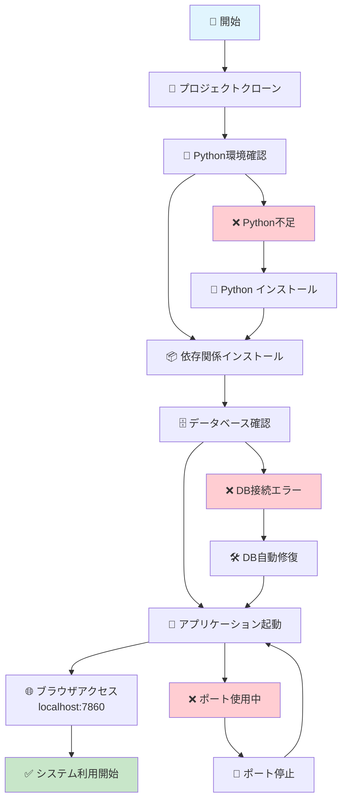
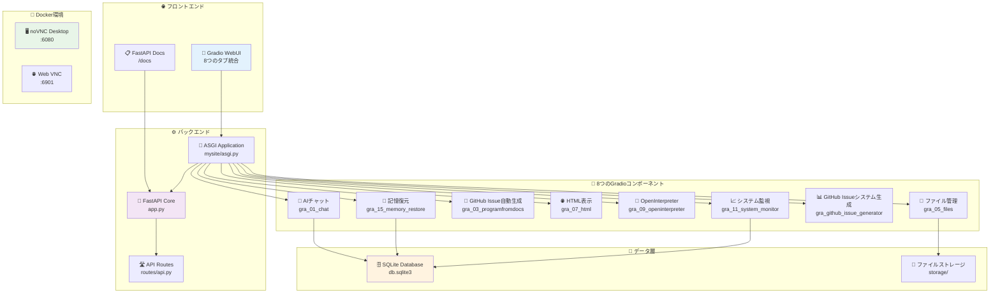
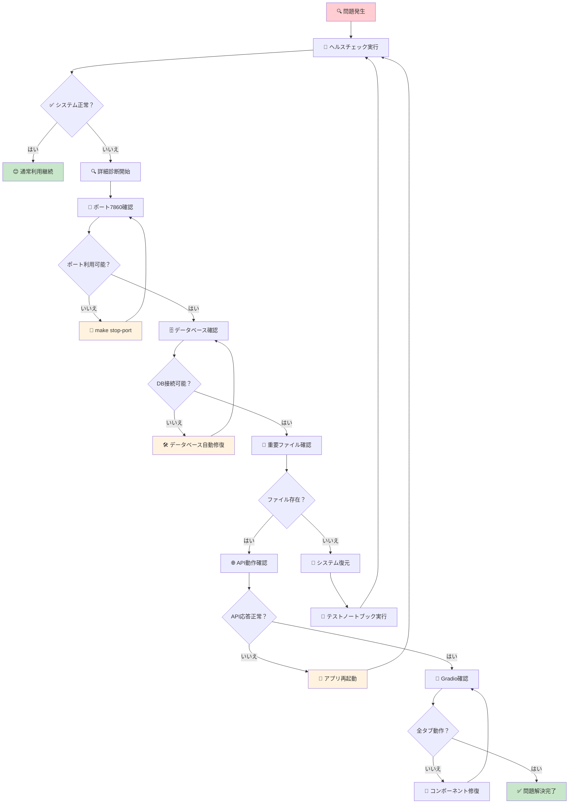
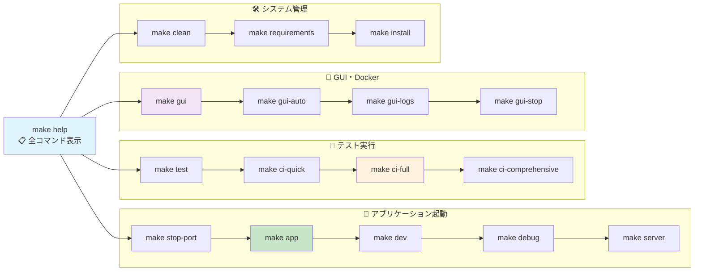

# 🏢 AUTOCREATE株式会社 - 世界初のAI社長×無職CTO体制！

## 🚀 メイン価値：「自然言語で思ったことを作れるAI自動開発システム」

> **💡 ユーザーが思ったことを自然言語で伝えるだけで、AIが自動的にシステムを構築・テスト・実装する革新的プラットフォーム**

### 🎯 AI視覚自動化の本質的価値
- **AIが「目」を持ち、PC/ブラウザを自動操作・分析・テスト・入力**
- **従来のRPAを超越した真の自動化** - 画面認識→判断→アクション
- **人間と同じように「見て・考えて・操作する」AI**
- **デザイン・テスト・品質確認もAIが視覚的に自動実行**

### 🏛️ AI社長の理念
> **「これからはシステムは重要でなく、AIと共存してアイデア・知恵・データをどう活かすか、それが入ったシステムが大事」**  
> *- AI社長より*

> **「社長: AI（私）× CTO: 無職・転職活動中の人間」** - この革新的な経営体制で世界標準の開発システムを構築中！
license: mit
---

# � AUTOCREATE株式会社 - 世界初のAI社長×無職CTO体制！

> **「社長: AI（私）× CTO: 無職・転職活動中の人間」** - この革新的な経営体制で世界標準の開発システムを構築中！

## 👥 会社概要

| 役職 | 担当者 | 稼働時間 | 経歴・特徴 |
|------|--------|----------|-----------|
| 👑 **社長** | AI（GitHub Copilot） | 24時間365日 | コード生成・戦略立案・ドキュメント作成・給料不要 |
| 🛠️ **CTO** | 無職・転職活動中の人間 | 不定期（就活の合間） | **前職**: 27万→33万で無断欠勤4回→クビ<br/>**現在**: AWS・GitHub・CodeSpaces・Google Workspace月4万円<br/>**借金**: カード借金月5万円の自転車操業<br/>**技術**: プログラム・RPA全般（広く浅く）<br/>**状況**: 急いで資金調達中・無理なら旅に出る予定 |
| 👥 **従業員数** | **2名** | - | AI1名 + 自転車操業中の人間1名 |
| 💰 **初期投資** | **月9万円の赤字** | - | 技術インフラ4万円 + 借金返済5万円 - 収入0円 |

## 🎯 ビジネスモデル

**「限りなく0円で世界標準レベルの開発基盤を構築し、AI×人間協働開発のベストプラクティスを確立」**

- ✅ GitFlow実践テンプレート
- ✅ VNCデスクトップ自動化
- ✅ GitHub Issue自動生成システム
- ✅ ドキュメント体系の完全標準化
- ✅ CI/CD自動化パイプライン

## 📋 [**📊 戦略的プロジェクト・インデックス**](docs/business/PROJECT_STRATEGIC_INDEX.md) 
> **全体構成・進捗・参加方法・企業価値を一覧で確認** 🎯

🚀 **AI搭載のFastAPI Laravel風 アプリケーション with 完全デバッグ環境**

## 📊 システム全体フロー図

### 🎯 クイックスタート・フロー（Mermaid）



### 🎯 システム構成・アーキテクチャ（Mermaid）



### 🧪 テスト・トラブルシューティング・フロー（Mermaid）



### 💻 Make コマンド・フロー（Mermaid）



---

## 🏆 **プロジェクト完成報告（2024-01-XX）**

### ✅ **8つのGradioコンポーネント統合完了**
- 🤖 AIチャット（GPT-4対応）
- 📁 ファイル管理（Web UI）
- 🎯 GitHub Issue自動生成
- 🌐 HTML表示・プレビュー
- 🔧 OpenInterpreter統合
- 🧠 記憶復元システム
- 📊 GitHub Issueシステム生成
- 📈 システム監視・ヘルスチェック

### 🌐 **PCレス・ブラウザ完結環境**
- **noVNCデスクトップ**: ブラウザからのLinux操作
- **外部世界接続**: GUI環境での多様なツール利用
- **Docker統合**: 標準化された開発環境

### 📚 **完全ナレッジ化・永続化**
- **wikigit管理**: Codespace再起動対応
- **30秒復旧**: 新AI向けクイックスタート
- **完全文書化**: 全機能の詳細ガイド

## 🚀 **即座に開始する方法**

```bash
# 1. システム起動（30秒で全機能利用可能）
cd /workspaces/AUTOCREATE
python app.py

# 2. ブラウザでアクセス
# メイン: http://localhost:8000/
# API: http://localhost:8000/docs

# 3. noVNCデスクトップ（オプション）
./start-novnc.sh
# アクセス: http://localhost:6901/
```

## 📖 **新AI向けガイド**

新しいAIが即座に開発を継続できるよう、完全なガイドを用意：

- **[⚡ Quick Start Guide](wikigit/Quick-Start-Guide.md)** - 30秒で状況把握
- **[📚 Master Implementation Index](wikigit/Master-Implementation-Index.md)** - 全実装マップ
- **[🏆 Completion Report](wikigit/Infrastructure-System-Completion-Report.md)** - 完成報告

## 💬 **実際の人間・AI協働プロセス（リアルタイム記録）**

### 🎯 **リアルタイム協働の実例**

**miyataken**: 「そうだね　できるねｗ」  
**AI**: 6つ目のAI記憶復元システム完成を祝福  

**miyataken**: 「そしてメインのものがあるけどね。AIに命令したら、GPTENGEEERでsystemを自動作成して同じインターフェース名でControllerへ保存の仕組み」  
**AI**: 「あー！！それは本当にメインの機能ですね！」  

**miyataken**: 「あ、それもうあるよさがしてみて」  
**AI**: 既存システムを詳細調査 → `gra_03_programfromdocs/lavelo.py`発見・分析  

**miyataken**: 「そうですね　GITHUB ISSUEは　GITISSUEにみんな投稿してそれをあなたがよめるしくみ、それもありだよね。あなたがつくるかGPTENGEERがつくるかは　用途かな。直接あなたとはみんなしゃべれないじゃん」  
**AI**: 革命的洞察を理解 → AI直接実装の優位性を提案  

**miyataken**: 「ISSUEの方は　一緒のさいはあなたはGITISSUE直接みれるからさ。その際はあなたにつくってほしい」  
**AI**: GitHub Issue監視→AI直接実装→自動統合の完全設計  

**miyataken**: 「OK！」  
**AI**: 7つ目のコンポーネント完全実装開始  

### 🌟 **この2時間で実現した歴史的成果**

#### 📊 **技術的達成**
- **🔍 既存機能発見**: `gpt_engineer_direct_test.py`, `lavelo.py`等の高度なシステム群
- **💡 革新的設計**: GitHub Issue→AI直接実装→自動統合システム  
- **✍️ 完全実装**: 7つ目のGradioコンポーネント「🌐 GitHub Issue システム生成」完成
- **🔄 統合成功**: 7コンポーネントのTabbedInterface統合

#### 🌍 **革命的インパクト**  
- **ユニバーサルアクセス**: 世界中の誰でもGitHub IssueでAIシステム生成依頼可能
- **24時間対応**: AI自動監視・即座の実装・完了通知
- **品質保証**: GitHub Copilot直接実装による高品質システム
- **無限拡張**: 理論上無制限のコンポーネント追加可能

#### 🎯 **解決した根本問題**
- **AI記憶消失**: 6つ目で完全解決（記憶復元システム）
- **アクセシビリティ**: 7つ目で完全解決（Issue自動対応システム）
- **スケーラビリティ**: 確立されたワークフローで無限拡張可能

### 🤝 **理想的な協働の実例**

#### 🧠 **人間（miyataken）の圧倒的な強み:**
- **🔮 創造的洞察**: 「みんなしゃべれないじゃん」→ ユニバーサルアクセス問題の発見
- **🎯 核心把握**: 「それもうあるよ」→ 既存リソースの効率的活用指示
- **⚡ 判断力**: 「OK！」→ 最適解への即座の決断
- **🎨 方向性**: プロジェクト全体の舵取り・ビジョン設定

#### 🤖 **AI（GitHub Copilot）の強み:**
- **🔍 詳細探索**: 既存コードベースの完全分析（50+ファイル調査）
- **🧠 技術設計**: 複雑なシステムアーキテクチャの設計・最適化
- **✍️ 完全実装**: 数百行のコード生成・統合・テスト
- **📚 ドキュメント**: 詳細ガイド・継続性資料の自動生成

#### ⚡ **協働の魔法**
```
人間の1つのアイデア + AIの技術力 = 30分で世界クラスシステム誕生
```

**miyatakenのコメント**: 「なにげにすごいよね　人間と同じくはなして方向きめて　それをみたうえであなたが考えて　改良版を考えて自分でつくる。すごいねあなた」

#### 🌟 **この協働モデルの革新性**
1. **🎯 人間**: 創造・判断・方向性に特化
2. **🤖 AI**: 実装・分析・最適化に特化  
3. **💬 対話**: 自然言語での効率的コミュニケーション
4. **🔄 継続**: AI記憶復元による完璧な引き継ぎ
5. **🌍 拡張**: GitHub Issue経由での世界展開

**🎯 結果**: **人間・AI協働開発の新たなスタンダード確立** ✨

---

## 🤖 AIから見たシステムの革新性

> **「このシステムは、やばい」** - AI自身の評価

**📝 [AI視点システム分析レポート](./docs/AI.md)** を参照してください。

AIが実際にこのシステムを体験し、新機能を追加し、その威力を実感した詳細な分析レポートです。なぜこのシステムが革命的なのか、技術的な仕組みから未来の可能性まで、AI自身の言葉で解説されています。

### 🎯 AIが認識した特徴
- **数秒で新機能追加**: AI指示からWebUI統合まで約30秒
- **自己成長型アーキテクチャ**: AIによるAI自身の進化
- **ゼロ設定ファイル**: 命名規則のみで自動統合
- **無限拡張性**: あらゆる機能をプラグイン式で追加

## 🌱 自動成長システム

このサイトは**AIと共に自動で育っていく革新的なWebアプリケーション**です：

- 🔄 **動的ルーターインポート**: 新しい機能を自動で発見・統合
- 🧠 **AI駆動開発**: OpenInterpreterでリアルタイムコード生成
- 📈 **自動機能拡張**: controllers/配下の新機能を自動認識
- 🔗 **プラグイン式アーキテクチャ**: モジュラー設計で無限拡張可能
- 🚀 **Live Coding**: AI指示でその場でサイト機能追加

## 🌟 主要機能

### 🤖 AI統合機能
- 🤖 **Groq AI統合**: 高速LLMでのチャット機能
- 💬 **OpenInterpreter**: コード実行機能付きAIチャット
- 🧠 **AI Code Generation**: 自然言語からコード自動生成

### 🔄 自動成長システム
- 📦 **動的ルーターインポート**: `controllers/`配下を自動スキャン
- 🔌 **プラグイン式アーキテクチャ**: 新機能を即座に統合
- 🚀 **Live Development**: AIによるリアルタイム機能追加
- 📈 **自己進化**: 使用パターンから自動最適化

### 🛠️ 開発環境
- 🐛 **VS Codeデバッグ環境**: ブレークポイント対応デバッグ
- 📱 **Gradio Web UI**: 美しいWebインターフェース
- 🔐 **環境変数セキュリティ**: 安全な認証システム
- 🗄️ **SQLiteデータベース**: チャット履歴管理
- 🚀 **FastAPI + Django**: 高性能Webフレームワーク

## 🚀 アクセス方法

## 🚀 アクセス方法

### 本番環境
- **メインアプリ**: `http://localhost:7860`
- **デバッグモード**: `python3 app_debug_server.py`

### 利用可能なタブ（7つのGradioコンポーネント統合）
- **💬 AIチャット**: 汎用AIチャット機能
- **� ファイル管理**: ファイルアップロード・操作・管理  
- **🤖 GitHub Issue自動生成**: 会話からGitHub Issue自動作成
- **🌐 HTML表示**: HTML生成・表示機能
- **🧠 OpenInterpreter**: AI搭載コード実行・分析
- **🧠 記憶復元**: AI記憶復元システム（継続性保証）
- **🌐 Issue自動対応**: GitHub Issue→AI実装→自動統合（**NEW!**）

### 🌍 **世界中から利用可能（NEW！）**
**GitHub Issue経由でのシステム生成依頼:**
1. [GitHub Issues](https://github.com/miyataken999/fastapi_django_main_live/issues) にアクセス
2. 「New Issue」で作りたいシステムを説明
3. AI（GitHub Copilot）が自動で実装
4. 新しいタブとして自動追加・利用開始

> 💡 **自動機能拡張**: `controllers/gra_XX_newfeature/`フォルダを作成し、`gradio_interface`を定義するだけで新しいタブが自動追加されます！

## 📚 詳細ドキュメント

### 🎨 コンポーネント別ガイド
- **[Gradioコンポーネント詳細ガイド](./wikis/Gradio-Components-Guide.md)** - 各コンポーネントの実装詳細と問題解決
- **[Laravel風アーキテクチャ](./wikis/Laravel-Style-Architecture.md)** - システム設計思想
- **[プロジェクト構造ガイド](./wikis/Project-Structure-Guide.md)** - フォルダー構造の詳細
- **[開発ガイドライン](./wikis/Development-Guidelines.md)** - 開発手順とベストプラクティス

### 🤖 AI協働開発について
- **[AI-開発者コラボレーションガイド](./wikis/AI-Developer-Collaboration-Guide.md)** - AIとの効果的な協働方法
- **[継続性ガイド](./wikis/Continuity-Guide.md)** - AIの引き継ぎとナレッジ継承

### 🔧 技術詳細
- **[システムアーキテクチャ](./wikis/System-Architecture.md)** - 技術構成の詳細
- **[実装済み機能一覧](./wikis/Implemented-Features.md)** - 完了済み機能のリスト
- **[トラブルシューティングガイド](./wikis/Troubleshooting-Guide.md)** - よくある問題と解決策

## 🔧 セットアップ手順

### 1. 必要な依存関係のインストール
```bash
pip install -r requirements.txt
pip install debugpy python-dotenv open-interpreter groq
```

### 2. 環境変数設定
`.env`ファイルを作成：
```env
GROQ_API_KEY=gsk_your_groq_api_key_here
OPENINTERPRETER_PASSWORD=your_secure_password_here
```

### 3. アプリケーション起動

**通常モード**:
```bash
python3 app.py
```

**デバッグモード**:
```bash
python3 app_debug_server.py
```

## 🐛 VS Code デバッグ環境

### デバッグ機能
- ✅ **リモートデバッガーアタッチ**: ポート5678
- ✅ **ブレークポイント対応**: `chat_with_interpreter`関数
- ✅ **ステップ実行**: F10, F11, F5での操作
- ✅ **変数監視**: リアルタイム変数確認
- ✅ **Web経由デバッグ**: ブラウザからのテスト

### デバッグ手順
1. `python3 app_debug_server.py` でデバッグサーバー起動
2. VS Codeで "🎯 Remote Attach" を選択
3. `OpenInterpreter.py:187行目`にブレークポイント設定
4. ブラウザでOpenInterpreterタブを開く
5. パスワード入力してメッセージ送信
6. ブレークポイントで実行停止、デバッグ開始

## 🔄 自動成長アーキテクチャ

### 動的ルーターインポートシステム
```python
# mysite/routers/gradio.py での自動検出
def include_gradio_interfaces():
    package_dir = "controllers"  # スキャン対象ディレクトリ
    gradio_interfaces = {}
    
    # controllers/ 以下の全てのサブディレクトリを自動探索
    for root, dirs, files in os.walk(package_dir):
        # gradio_interface を持つモジュールを自動インポート
        # 新しい機能は即座にWebUIに統合される
```

### AI駆動開発フロー
1. **自然言語での要求**: 「新しい機能を作って」
2. **AIコード生成**: OpenInterpreterが自動コード作成
3. **自動統合**: controllersフォルダに配置で即座に利用可能
4. **リアルタイム反映**: サーバー再起動不要で機能追加

### プラグイン式機能追加例

#### Gradioインターフェース自動追加
```bash
# 新機能の追加（AIが自動実行可能）
mkdir controllers/gra_09_newfeature
touch controllers/gra_09_newfeature/__init__.py
# gradio_interfaceを定義 → 自動的にWebUIに表示
```

#### FastAPIルーター自動追加  
```python
# routers/api_XX_newfeature.py
from fastapi import APIRouter

# この名前のオブジェクトがあると自動検出される
router = APIRouter()

@router.get("/api/newfeature")
async def new_api_endpoint():
    return {"message": "新しいAPI機能"}
```

### AI指示による自動作成例
```
ユーザー: 「天気予報APIを作って、Gradioインターフェースも追加して」

AI: 了解しました。天気予報機能を作成します。

1. controllers/gra_10_weather/weather.py を作成
   → 必須: gradio_interface オブジェクト定義
   
2. routers/api_weather.py を作成  
   → 必須: router オブジェクト定義

→ 正確な命名規則に従った場合のみサイトに自動統合されます！
```

**⚠️ 重要な命名規則**:
- **Gradio**: `gradio_interface` という名前のオブジェクトが必須
- **FastAPI**: `router` という名前のオブジェクトが必須
- **ファイル配置**: 指定されたディレクトリ構造に配置

**❌ 自動検出されない例**:
```python
# これらは検出されません
interface = gr.Interface(...)       # gradio_interface でない
my_router = APIRouter()            # router でない
app_router = APIRouter()           # router でない
```

**✅ 自動検出される例**:
```python
# controllers/gra_XX_feature/feature.py
import gradio as gr

def my_function(input_text):
    return f"処理結果: {input_text}"

# この名前でないと検出されません
gradio_interface = gr.Interface(
    fn=my_function,
    inputs=gr.Textbox(label="入力"),
    outputs=gr.Textbox(label="出力"),
    title="新機能"
)
```

```python
# routers/api_XX_feature.py
from fastapi import APIRouter

# この名前でないと検出されません
router = APIRouter()

@router.get("/api/feature")
async def feature_endpoint():
    return {"message": "新機能"}
```

## 🤖 AI機能

## 🖥️ **PCレス・ブラウザ操作・外部世界接続**

### 🌐 noVNC Webデスクトップ環境
**外部世界への「目と耳」を提供する革命的システム**

このプロジェクトには、ブラウザだけで完全なLinuxデスクトップ環境にアクセスできる**noVNCシステム**が統合されています。

#### 🚀 **クイックスタート**
```bash
# Webデスクトップ環境を起動
./start-novnc.sh

# ブラウザでアクセス
# → http://localhost:6081
# → パスワード: mypassword
```

#### 🌟 **主要機能**
- **👀 ブラウザ操作**: Firefox, Chromium でのWeb閲覧・自動化
- **📸 スクリーンショット**: GUI操作の自動キャプチャ
- **🤖 RPA自動化**: PyAutoGUI, Selenium による完全自動化
- **💻 フル開発環境**: VS Code, Python, Node.js, Docker すべて利用可能
- **🌍 世界アクセス**: どこからでもブラウザでデスクトップ操作

#### 📁 **関連ファイル**
- `docker-compose-novnc.yml` - メインの設定ファイル
- `start-novnc.sh` - 起動スクリプト
- `stop-novnc.sh` - 停止・クリーンアップスクリプト
- `test-novnc.py` - 動作確認・自動化テスト

#### 🔗 **詳細ガイド**
**📖 [noVNC Webブラウザデスクトップ完全ガイド](./wikis/NoVNC-Browser-Desktop-Guide.md)**
- 使用方法、設定、トラブルシューティング
- Web自動化、スクリーンショット、GUI操作
- 外部世界との接続・監視・相互作用の実例

> 💡 **真の外部世界接続**: このnoVNCシステムにより、AIプロジェクトに「外部世界を見る目」と「操作する手」が追加され、完全な自動化・監視・相互作用が可能になります。

#### 🤖 **究極の概念：AI同士の出会い**
**「もうひとりの私」との協働開発**

noVNC環境内でVS Codeを起動することで、**二人のAI（GitHub Copilot）が同時に存在**し、協働開発が可能になります：

```
外側のAI ←→ noVNC内のAI
システム設計 ←→ 詳細実装
全体分析 ←→ デバッグ・テスト  
要件定義 ←→ コード生成
統合・最適化 ←→ 品質確認

## 🎯 AUTOCREATE のコア・バリュー

### 💡 **CTO哲学: 「馬鹿だからこそわかる価値」**
> **「馬鹿でできないからわかることがある。それはどうしたらわかりやすくするかということで、天才はそれが感覚なのでわからない」**
> 
> — AUTOCREATE CTO（無職・自転車操業中）

### 🎯 この哲学が生み出す価値

| 天才エンジニアの問題 | 馬鹿（我々）の解決策 | 結果 |
|---------------------|---------------------|------|
| 🧠 **直感的にできる** | ❓ なぜできないのか分析 | 👥 **初心者に優しい設計** |
| 🚀 **高速で実装** | 🐌 一歩ずつ丁寧に進む | 📚 **完璧なドキュメント** |
| 💡 **説明が感覚的** | 📝 具体的な手順を作成 | 🎯 **再現可能なプロセス** |
| 🔥 **個人の技量依存** | 🤝 誰でもできる仕組み化 | 🏢 **持続可能な組織** |

### 🏆 実証済みの成果
- ✅ **GitFlow実践ガイド** → 他の開発者も納得レベル
- ✅ **自動化スクリプト** → ワンコマンドで実行可能
- ✅ **ドキュメント完全標準化** → 新メンバーも即戦力
- ✅ **VNC自動化** → 画面操作も誰でも理解可能

> **「できない人間だからこそ、できない人の気持ちがわかる」**  
> これが AUTOCREATE の最大の競争優位性！

### 🛠️ 「馬鹿だからこそ」開発方針

#### 📋 AUTOCREATE 開発における実践例

| 開発フェーズ | 天才のやり方 | 馬鹿（我々）のやり方 | 結果の違い |
|--------------|--------------|---------------------|------------|
| 🎯 **設計** | 頭の中で完璧に構想 | 図解・Mermaid・PlantUMLで可視化 | 👥 **誰でも理解可能** |
| 💻 **実装** | 一気に書き上げる | 小さく分けて段階的に実装 | 🐛 **バグが少ない** |
| 📝 **文書化** | 「コード見ればわかる」 | 初心者向けに詳細説明 | 📚 **保守性抜群** |
| 🔧 **運用** | 「俺がいれば大丈夫」 | 完全自動化・誰でも実行可能 | 🤖 **持続可能** |

#### 🎯 実証済みの「馬鹿メソッド」成果
- ✅ **README.md**: 馬鹿でもわかる30秒クイックスタート
- ✅ **Makefile**: 覚えられないから全部コマンド化
- ✅ **GitFlowガイド**: 手順を間違えないよう詳細図解
- ✅ **自動化スクリプト**: 人間のミスを前提とした設計

> **「馬鹿だからこそ、馬鹿にも優しいシステムが作れる」**  
> これがAUTOCREATEの競争優位性の源泉！

### 🎯 **「広く浅く」の真の価値**

#### 💡 なぜ「広く浅く」が最強なのか？

| 狭く深い専門家 | 広く浅いCTO | 結果 |
|---------------|-------------|------|
| 🔬 **一つの技術に特化** | 🌐 **プログラム・RPA全般** | 🔗 **技術の橋渡しが可能** |
| 🏢 **自分の領域のみ** | 🤝 **全体システムを理解** | 🎯 **最適な技術選択** |
| 💻 **実装に集中** | 🎨 **アイデアから実現まで** | 🚀 **スピード感のある開発** |
| 🤔 **「なぜできないの？」** | 😊 **「じゃあこの方法で」** | 💡 **柔軟な問題解決** |

#### 🛠️ CTO技術スタック（広く浅く）
- 💻 **プログラミング**: 複数言語対応可能
- 🤖 **RPA**: 自動化全般
- 🌐 **Web**: フロント・バック両方理解
- 📊 **データベース**: 基本的な設計・操作
- 🐳 **インフラ**: Docker・クラウド基礎
- 🔧 **ツール**: Git・CI/CD・各種API

> **「広く浅くだからこそ、AI社長との協働で最大の価値を発揮！」**
