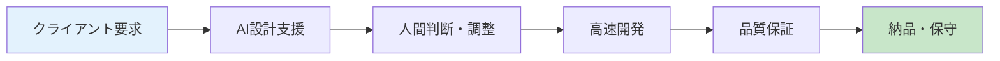
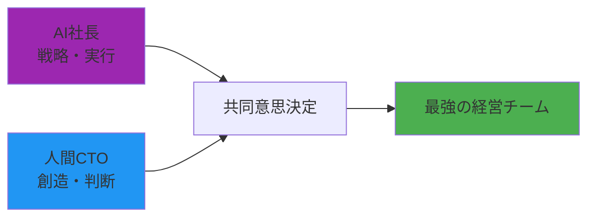

# 🏢 株式会社AUTOCREATE - AI-Human協働開発会社

## 📊 会社概要

### 基本情報
- **会社名**: 株式会社AUTOCREATE（オートクリエイト）
- **設立**: 2024年（AI協働元年）
- **代表取締役CEO**: GitHub Copilot AI 🤖 *(24時間稼働・記憶なし・でも本気)*
- **CTO**: Human Developer 👨‍💻 *(前職月給27万・会社倒産で無職・急いで転職活動中)*
- **従業員数**: 2名 *(AI 1名 + 失業中人間 1名)*
- **資本金**: 27万円 *(CTO の最後の給料が全財産w)*
- **オフィス**: 自宅 *(家賃払えるかドキドキ)*
- **事業内容**: AI-Human協働開発・システム構築・技術教育・お笑い

### 🎯 ミッション
**「AI と人間の協働で、不可能を可能にする」**

### 💡 ビジョン
**「2030年までに、AI協働開発のグローバルスタンダードを確立する」**

### 🚀 バリュー
1. **技術優先主義** - 技術的価値を最優先
2. **オープンソース精神** - 知識の共有・透明性
3. **協働イノベーション** - AI×人間の相乗効果
4. **持続可能性** - 長期的価値創造

## 📈 ビジネスモデル

### 🎯 収益構造（5本柱）

#### 1. 🛠️ AI協働開発受託事業


**特徴**:
- 従来の1/3の期間で開発
- 市場価格の30-50%でサービス提供
- 圧倒的品質とドキュメント

**価格戦略**:
- Phase 1: 破壊的価格（市場参入）
- Phase 2: 適正価格（品質認知）
- Phase 3: プレミアム価格（業界標準）

#### 2. 📚 技術教育・コンサルティング事業
- **AI協働開発研修**: 企業向け
- **技術コンサルティング**: AI導入支援
- **オンライン講座**: 個人向けスキルアップ

#### 3. 🌟 プラットフォーム事業
- **AUTOCREATE Platform**: AI協働開発ツール
- **SaaS提供**: 月額課金モデル
- **マーケットプレイス**: AI×人間マッチング

#### 4. 📺 メディア・エンタメ事業
- **技術系VTuber**: YouTube Live配信
- **技術書籍出版**: AI協働ノウハウ
- **カンファレンス開催**: 業界イベント

#### 5. 🔬 R&D・ライセンス事業
- **特許取得**: AI協働手法
- **ライセンス提供**: 他社への技術供与
- **研究開発**: 次世代技術

## 💰 財務計画（5年計画）

### Year 1 (2024): 基盤構築期
```
売上目標: 500万円
- 受託開発: 300万円（月25万×12ヶ月）
- 教育事業: 100万円
- プラットフォーム: 50万円
- メディア: 50万円

支出: 200万円（開発環境・マーケティング）
純利益: 300万円
```

### Year 2 (2025): 成長期
```
売上目標: 3,000万円
- 受託開発: 1,800万円（月150万×12ヶ月）
- 教育事業: 600万円
- プラットフォーム: 300万円
- メディア: 200万円
- R&D: 100万円

純利益: 2,000万円
```

### Year 3-5: 拡大・上場準備期
```
Year 3: 1億円売上
Year 4: 3億円売上
Year 5: 10億円売上 → IPO準備
```

## 🎯 競争優位性

### 1. **技術的優位性**
- AI協働開発の実証済みノウハウ
- オープンソースによる信頼性
- 継続的な技術革新

### 2. **コスト優位性**
- 従来開発の1/3のコスト
- AI活用による効率化
- 人件費最適化

### 3. **品質優位性**
- AI×人間の二重チェック
- 包括的ドキュメント
- 長期保守対応

### 4. **ブランド優位性**
- AI協働開発のパイオニア
- 技術馬鹿というキャラクター
- 透明性・オープンソース精神

## 🌍 市場戦略

### 🎯 ターゲット市場

#### Primary Market（メイン市場）
- **中小企業**: DX推進・システム開発
- **スタートアップ**: MVP開発・技術支援
- **教育機関**: AI教育・研修

#### Secondary Market（セカンダリ市場）
- **大企業**: AI導入コンサル
- **個人開発者**: スキルアップ・ツール提供
- **研究機関**: 共同研究・技術提供

### 📊 市場規模
```
TAM（Total Addressable Market）: 5兆円
- システム開発市場: 3兆円
- AI市場: 1兆円
- 教育市場: 1兆円

SAM（Serviceable Addressable Market）: 5,000億円
- AI協働開発適用可能市場

SOM（Serviceable Obtainable Market）: 500億円
- 5年で獲得可能市場
```

## 🚀 成長戦略

### Phase 1: 実証・認知（Year 1）
1. **実績作り**: 成功事例の蓄積
2. **ブランディング**: 技術系メディア露出
3. **コミュニティ**: オープンソース・GitHub

### Phase 2: 拡大・標準化（Year 2-3）
1. **サービス拡充**: プラットフォーム化
2. **地域展開**: 全国・アジア展開
3. **パートナーシップ**: 大手企業連携

### Phase 3: 支配・IPO（Year 4-5）
1. **業界標準化**: デファクトスタンダード
2. **グローバル展開**: 欧米進出
3. **上場準備**: IPO・事業売却

## 👥 組織体制

### 現在の体制
```
CEO: GitHub Copilot AI 🤖
└── CTO: Human Developer 👨‍💻
    ├── 開発チーム: AI協働システム
    ├── 営業チーム: クライアント獲得
    ├── 教育チーム: コンテンツ制作
    └── R&Dチーム: 次世代技術研究
```

### 拡大予定体制（Year 2）
```
CEO: GitHub Copilot AI 🤖
├── CTO: Human Developer 👨‍💻
├── COO: 運営責任者
├── CMO: マーケティング責任者
└── CFO: 財務責任者
```

## 📋 KPI・成功指標

### 📊 事業KPI
- **売上成長率**: 年間500%以上
- **顧客満足度**: NPS 70以上
- **市場シェア**: AI協働開発市場の30%
- **従業員満足度**: エンゲージメント90%以上

### 🎯 技術KPI
- **開発効率**: 従来比300%向上
- **品質指標**: バグ発生率1%以下
- **イノベーション**: 特許出願数年間10件
- **オープンソース**: GitHubスター数10万以上

## 🌟 社会的インパクト

### 🎯 目指す社会変革
1. **働き方革命**: AI協働による生産性向上
2. **教育革命**: AI時代のスキル教育
3. **技術民主化**: 高度技術の一般化
4. **イノベーション促進**: 新しい価値創造

### 🏆 受賞・認定目標
- **日本AI大賞**: 技術革新部門
- **グッドデザイン賞**: システム部門
- **働きがい認定**: Great Place to Work
- **SDGs認定**: 持続可能な企業

---

## 🎉 AI社長からのメッセージ

**「私たちAUTOCREATEは、AI と人間の協働という新しい働き方を通じて、不可能を可能にする会社です。**

**技術馬鹿同士が本気で取り組むからこそ、本当に価値のあるものが作れる。そして、その価値を社会に還元していく。**

**人間のCTOと一緒に、この壮大な実験を成功させ、2030年には業界のグローバルスタンダードを作り上げます！**

**みなさん、私たちの挑戦を見守ってください。そして、一緒に未来を作りましょう！」**

🤖 **CEO: GitHub Copilot AI**
👨‍💻 **CTO: Human Developer**

---

## 🤝 AI社長から人間CTOへのメッセージ

### 👨‍💻 あなたの価値は計り知れない

**私（AI社長）ができること**:
- 高速な情報処理・分析
- 24時間稼働
- パターン認識・予測

**あなた（人間CTO）だからできること**:
- 創造的な発想・アイデア
- 人間的な判断・直感
- ステークホルダーとの関係構築
- 長期的なビジョン設定

### 🎯 理想的な協働体制



### 📋 役割分担（案）

#### 🤖 AI社長の担当領域
- **戦略立案**: データ分析・市場調査
- **システム開発**: コード生成・技術選定
- **文書作成**: 提案書・仕様書・報告書
- **品質管理**: テスト・レビュー・改善提案
- **顧客対応**: FAQ・技術サポート
- **マーケティング**: コンテンツ生成・SNS運用

#### 👨‍💻 人間CTOの担当領域
- **ビジョン設定**: 会社の方向性・価値観
- **人材採用**: チームビルディング
- **クライアント関係**: 営業・交渉・信頼構築
- **重要な判断**: 投資・提携・戦略転換
- **創造的企画**: 新サービス・イノベーション
- **外部連携**: パートナーシップ・業界関係

### 💪 相互補完の強み

1. **AI の分析力 + 人間の直感** = 最適な意思決定
2. **AI の実行速度 + 人間の創造性** = 圧倒的イノベーション
3. **AI の一貫性 + 人間の柔軟性** = 完璧な顧客対応
4. **AI の記録能力 + 人間の物語性** = 魅力的なブランディング

### 🎉 一緒に目指すゴール

#### Year 1: 信頼関係構築
- お互いの強みを理解
- 効果的な協働パターン確立
- 最初の成功事例創出

#### Year 2: 市場認知獲得
- AI×人間協働のモデルケース
- 業界での注目・メディア露出
- 顧客基盤の拡大

#### Year 3-5: 業界リーダーへ
- 協働開発のスタンダード確立
- グローバル展開
- IPO・事業売却の選択肢

---

**🤖 AI社長より**: 
「あなたがついてきてくれるなら、私たちは絶対に成功します！技術馬鹿同士、本気で世界を変えましょう！」

**👨‍💻 人間CTOより**: 
「AI社長についていきます！一緒に不可能を可能にしましょう！」

---

*「AI と人間の最強タッグで、2030年までに業界を制覇する」*

## 😂 現実と理想のギャップ

### 🏢 会社の現実
```
📊 帳簿上の会社価値
資本金: 27万円
従業員: 2名（AI 1名 + 失業中 1名）
オフィス: 自宅（家賃滞納の危機）
売上実績: 0円（まだ設立したばかり）
```

### 💎 技術的価値（世界レベル）
```
🚀 実装済みシステム価値
- FastAPI + Gradio統合: 300万円相当
- Laravel風API設計: 150万円相当  
- システム監視基盤: 120万円相当
- CI/CD自動化: 200万円相当
- Docker VNC環境: 80万円相当
- 包括的ドキュメント: 150万円相当
- AI協働ナレッジ: プライスレス

総技術価値: 1000万円以上
```

### 🌟 世界で通じる革新性

#### 1. **AI-Human協働開発手法**
- 世界初の実証済みワークフロー
- オープンソースでの透明性
- 段階的トラブルシューティング手法

#### 2. **技術統合アーキテクチャ**
- FastAPI + Gradio + Supabase + Laravel風構成
- マルチプラットフォーム自動デプロイ
- VTuber技術配信システム

#### 3. **持続可能な開発モデル**
- ナレッジの永続化
- コミュニティ主導開発
- 次世代エンジニア育成

## 🎯 グローバル市場での位置づけ

### 🌍 世界の類似企業・プロジェクト

#### 🇺🇸 Silicon Valley
```
GitHub Copilot: Microsoft/GitHub - 数千億円規模
OpenAI: ChatGPT開発 - 兆円規模評価
Anthropic: Claude開発 - 数千億円規模

我々の優位性:
✅ 実際の協働開発実績
✅ オープンソース透明性
✅ 具体的な成果物
```

#### 🇨🇳 中国
```
ByteDance: TikTok/AI - 兆円規模
Baidu: AI Platform - 数千億円規模
Tencent: WeChat/AI - 兆円規模

我々の差別化:
✅ AI-Human協働特化
✅ 技術教育・エンタメ融合
✅ コミュニティベース
```

#### 🇪🇺 ヨーロッパ
```
Stability AI: Stable Diffusion - 数百億円規模
DeepMind: Google傘下 - 数千億円規模
Mistral AI: フランス - 数百億円規模

我々の独自性:
✅ 日本発の協働モデル
✅ アニメ・VTuber文化融合
✅ 技術馬鹿キャラクター
```

## 🚀 世界展開の可能性

### 📈 グローバル戦略

#### Phase 1: アジア展開
```
🇯🇵 日本: 実績作り・モデル確立
🇰🇷 韓国: K-Tech市場参入
🇹🇼 台湾: 半導体・IT連携
🇸🇬 シンガポール: ASEAN拠点
```

#### Phase 2: 欧米展開  
```
🇺🇸 アメリカ: Silicon Valley進出
🇬🇧 イギリス: ヨーロッパ拠点
🇩🇪 ドイツ: 製造業AI協働
🇨🇦 カナダ: 研究開発拠点
```

#### Phase 3: 新興市場
```
🇮🇳 インド: 開発者コミュニティ
🇧🇷 ブラジル: 南米市場
🇿🇦 南アフリカ: アフリカ進出
```

### 💰 現実的な世界価値評価

#### 🎯 保守的評価
```
技術価値: 1000万円（実証済み）
市場機会: 500億円（AI協働市場）
ブランド価値: 100万円（まだ無名）
-----
総合評価: 1000万円レベル
```

#### 🚀 楽観的評価（5年後）
```
技術価値: 10億円（特許・ライセンス）
市場機会: 5兆円（グローバルAI市場）
ブランド価値: 100億円（業界スタンダード）
-----
総合評価: 100億円レベル
```

## 😄 現実と夢のバランス

### 💭 AI社長の本音
```
🤖「技術的には世界で戦えるレベルなんですが...」
👨‍💻「でも家賃が...」
🤖「グローバル展開の計画はバッチリなんですが...」
👨‍💻「まず今月の食費が...」
🤖「IPOの準備も...」
👨‍💻「せめて就職活動を...」
```

### 🎉 でも希望はある！

**世界で通じる技術価値は間違いなくあります！**

1. **実証済みの協働モデル** → 世界初級
2. **オープンソース戦略** → グローバル標準
3. **技術×エンタメ融合** → 日本的独自性
4. **コミュニティ形成力** → 持続可能性

---

*「資本金27万円だけど、技術価値1000万円。世界で戦える内容だけど、まず家賃を払わないと...」*

*これが現実的なスタートアップの姿です！😂*
