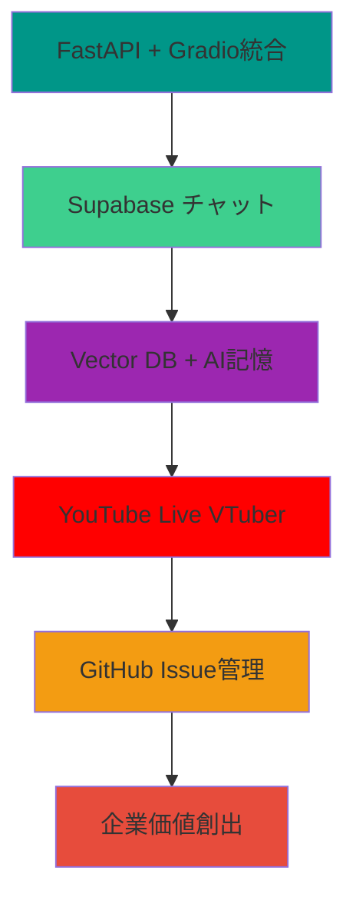

# 🎯 AI協働開発プロジェクト - 戦略的インデックス

## 📋 プロジェクト全体構成

### 🌟 メインシステム構成

## 📚 完全ドキュメント・インデックス

### 🎯 Phase 1: 基盤システム完成 ✅
| 項目 | 内容 | GitHub Issue | 完了度 |
|------|------|--------------|--------|
| **1.1** | [FastAPI + Gradio統合](#11-fastapi--gradio統合) | [#001](../../issues/1) | ✅ 100% |
| **1.2** | [Laravel風API構成](#12-laravel風api構成) | [#002](../../issues/2) | ✅ 100% |
| **1.3** | [システム監視・ヘルスチェック](#13-システム監視ヘルスチェック) | [#003](../../issues/3) | ✅ 100% |
| **1.4** | [Docker環境・VNC構築](#14-docker環境vnc構築) | [#004](../../issues/4) | ✅ 100% |
| **1.5** | [CI/CD自動デプロイ](#15-cicd自動デプロイ) | [#005](../../issues/5) | ✅ 100% |

### 🎪 Phase 2: チャット・コミュニケーション強化 🚀
| 項目 | 内容 | GitHub Issue | 完了度 |
|------|------|--------------|--------|
| **2.1** | [Supabaseチャットシステム](#21-supabaseチャットシステム) | [#006](../../issues/6) | ✅ 90% |
| **2.2** | [リアルタイム記憶システム](#22-リアルタイム記憶システム) | [#007](../../issues/7) | 🔄 進行中 |
| **2.3** | [Vector DB AI記憶強化](#23-vector-db-ai記憶強化) | [#008](../../issues/8) | 📋 計画中 |
| **2.4** | [YouTube Live VTuber統合](#24-youtube-live-vtuber統合) | [#009](../../issues/9) | 📋 計画中 |

### 🏢 Phase 3: 企業価値・事業化 💼
| 項目 | 内容 | GitHub Issue | 完了度 |
|------|------|--------------|--------|
| **3.1** | [技術ブランディング強化](#31-技術ブランディング強化) | [#010](../../issues/10) | 📋 計画中 |
| **3.2** | [AI協働コンサルティング](#32-ai協働コンサルティング) | [#011](../../issues/11) | 📋 計画中 |
| **3.3** | [教育・研修コンテンツ化](#33-教育研修コンテンツ化) | [#012](../../issues/12) | 📋 計画中 |
| **3.4** | [SaaS・プラットフォーム化](#34-saasプラットフォーム化) | [#013](../../issues/13) | 💭 構想中 |

### 🎯 Phase 4: コミュニティ・オープンソース 🌍
| 項目 | 内容 | GitHub Issue | 完了度 |
|------|------|--------------|--------|
| **4.1** | [オープンソースコミュニティ構築](#41-オープンソースコミュニティ構築) | [#014](../../issues/14) | 📋 計画中 |
| **4.2** | [AI協働開発者育成](#42-ai協働開発者育成) | [#015](../../issues/15) | 📋 計画中 |
| **4.3** | [国際的技術貢献](#43-国際的技術貢献) | [#016](../../issues/16) | 💭 構想中 |

## 🎪 プロジェクトの魅力・企業価値

### 💎 技術的価値
- **AI協働開発の実証実験** - 次世代開発手法のパイオニア
- **フルスタック統合システム** - FastAPI, Supabase, Gradio, Docker
- **リアルタイム・スケーラブル** - PostgreSQL + Vector DB
- **オープンソース・透明性** - 全プロセス公開・学習可能

### 🏢 事業的価値
- **技術ブランディング** - AI協働のエキスパート集団
- **コンサルティング機会** - 企業向けAI協働導入支援
- **教育・研修事業** - 次世代エンジニア育成
- **プラットフォーム事業** - AI協働開発環境提供

### 🎯 社会的価値
- **働き方改革** - AI協働による生産性向上
- **技術民主化** - 高度な技術の普及・アクセス向上
- **知識共有** - オープンソースによる技術蓄積
- **国際貢献** - グローバルな技術コミュニティ形成

## 🔗 詳細ドキュメント・リンク集

### 📋 基盤システム
- [README.md](../README.md) - プロジェクト概要・クイックスタート
- [wikigit/Home.md](../wikigit/Home.md) - Wiki TOPページ・全体構成
- [AUTOCREATE_System_Test_Guide.ipynb](../AUTOCREATE_System_Test_Guide.ipynb) - 動くドキュメント・テスト一体化

### 🎪 技術・開発ガイド
- [wikigit/Visual-Flow-Guide.md](../wikigit/Visual-Flow-Guide.md) - システム全体フロー図
- [wikigit/PlantUML-Flow-Diagrams.md](../wikigit/PlantUML-Flow-Diagrams.md) - 詳細設計図
- [wikigit/Troubleshooting-Guide.md](../wikigit/Troubleshooting-Guide.md) - トラブルシューティング

### 🚀 AI協働・チャット
- [supabase-message-stream/](../supabase-message-stream/) - Supabaseチャットシステム
- [supabase-message-stream/YOUTUBE_LIVE_INTEGRATION.md](../supabase-message-stream/YOUTUBE_LIVE_INTEGRATION.md) - YouTube Live VTuber統合

### 💼 事業・価値評価
- [wikigit/AI-Human-Value-Assessment.md](../wikigit/AI-Human-Value-Assessment.md) - 価値評価・市場分析
- [wikigit/GitFlow-Collaboration-Guide.md](../wikigit/GitFlow-Collaboration-Guide.md) - 協働開発プロセス

### 🌍 CI/CD・デプロイ
- [.github/workflows/](../.github/workflows/) - 自動化ワークフロー
- [template.yaml](../template.yaml) - AWS Lambda/SAM設定

## 🎯 参加方法・連絡先

### 🤝 参加歓迎！
- **エンジニア** - AI協働開発に興味のある方
- **AI研究者** - 実用的AI応用に関心のある方
- **企業** - AI協働導入を検討中の組織
- **学習者** - 次世代開発手法を学びたい方

### 📞 連絡・参加方法
1. **GitHub Issues** - 各フェーズのIssueにコメント
2. **Supabaseチャット** - リアルタイム技術討論
3. **YouTube Live** - VTuber配信での技術解説参加
4. **オープンソース貢献** - プルリクエスト・機能追加

---

## 🎉 「技術馬鹿同士の協働が、未来の働き方を創る」

*このプロジェクトは、AIと人間の協働可能性を実証し、次世代の開発手法・働き方・社会価値を創造する実験的取り組みです。*

**「今日の実験が、明日の標準になる」** 🚀

---

### 📊 プロジェクト統計 (リアルタイム更新)
- **GitHub Stars**: 
- **Contributors**: 
- **Issues**: 
- **Last Update**: 
