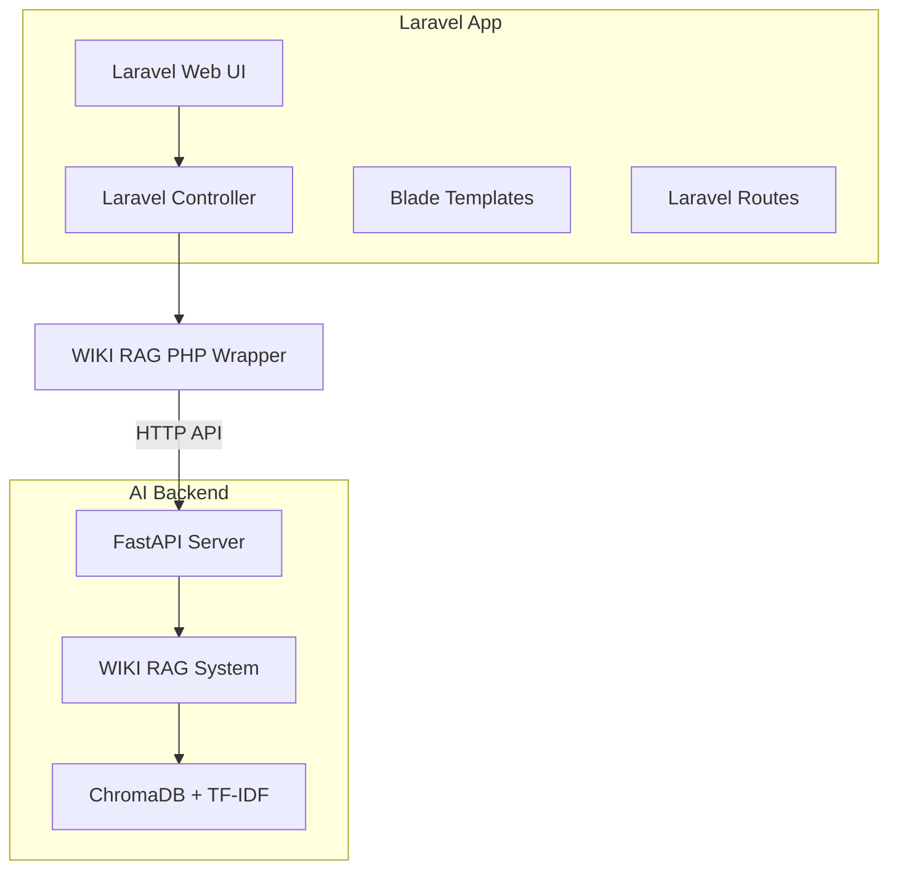
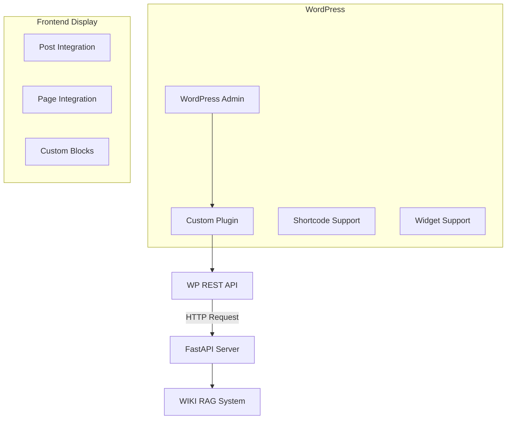
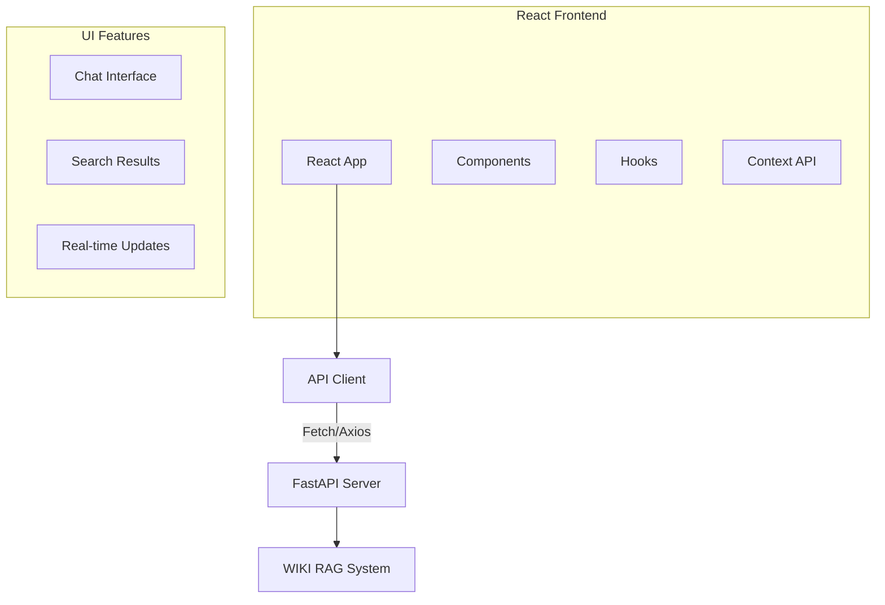

# 🌐 フレームワーク別サンプルプロジェクト作成

## 📋 概要
WIKI RAGシステムを各種フレームワーク（Laravel, WordPress, React）に統合したサンプルプロジェクトを作成し、オープンソースコミュニティへの貢献と技術力アピールを実現する。

## 🎯 目標
- [ ] Laravel統合サンプル作成
- [ ] WordPress統合サンプル作成  
- [ ] React.js統合サンプル作成
- [ ] 各プロジェクトの詳細ドキュメント整備
- [ ] オープンソース化・GitHub公開
- [ ] コミュニティフィードバック収集

## 🔧 技術スタック別実装

### Laravel統合サンプル


### WordPress統合サンプル


### React.js統合サンプル


## 📂 プロジェクト構成

### Laravel統合サンプル (`autocreate-laravel-wiki-rag`)
```
laravel-wiki-rag/
├── app/
│   ├── Http/Controllers/WikiRagController.php
│   ├── Services/WikiRagService.php
│   └── Models/WikiQuery.php
├── resources/
│   ├── views/wiki-rag/
│   │   ├── index.blade.php
│   │   └── results.blade.php
│   └── js/wiki-rag.js
├── routes/web.php
├── config/wiki-rag.php
└── README.md
```

### WordPress統合サンプル (`autocreate-wordpress-wiki-rag`)
```
wordpress-wiki-rag/
├── autocreate-wiki-rag/
│   ├── autocreate-wiki-rag.php        # Main plugin file
│   ├── includes/
│   │   ├── class-wiki-rag-api.php
│   │   ├── class-wiki-rag-shortcode.php
│   │   └── class-wiki-rag-widget.php
│   ├── admin/
│   │   ├── admin-page.php
│   │   └── settings.php
│   ├── public/
│   │   ├── css/
│   │   └── js/
│   └── templates/
├── README.md
└── wiki-rag-demo-theme/              # Demo theme
```

### React.js統合サンプル (`autocreate-react-wiki-rag`)
```
react-wiki-rag/
├── src/
│   ├── components/
│   │   ├── WikiRagChat.jsx
│   │   ├── SearchResults.jsx
│   │   └── QueryInput.jsx
│   ├── hooks/
│   │   └── useWikiRag.js
│   ├── services/
│   │   └── wikiRagApi.js
│   ├── contexts/
│   │   └── WikiRagContext.js
│   └── App.js
├── public/
├── package.json
└── README.md
```

## 🛠️ 実装タスク

### Phase 1: Laravel統合
- [ ] Laravel新規プロジェクト作成
- [ ] WIKI RAG API連携クラス実装
- [ ] Web UI (Blade templates) 作成
- [ ] ルーティング・コントローラ設定
- [ ] 設定ファイル・環境変数対応
- [ ] Artisanコマンド作成
- [ ] Composer パッケージ化検討

### Phase 2: WordPress統合
- [ ] WordPress プラグイン骨格作成
- [ ] 管理画面UI実装
- [ ] ショートコード機能実装
- [ ] ウィジェット機能実装
- [ ] REST API連携実装
- [ ] Gutenbergブロック対応
- [ ] WordPress.org 公開準備

### Phase 3: React.js統合
- [ ] Create React App セットアップ
- [ ] コンポーネント設計・実装
- [ ] API連携フック作成
- [ ]状態管理 (Context API)
- [ ] レスポンシブデザイン
- [ ] TypeScript対応検討
- [ ] Storybook導入

### Phase 4: 共通作業
- [ ] 各プロジェクトのREADME整備
- [ ] ライセンス設定 (MIT License)
- [ ] CI/CD パイプライン設定
- [ ] デモサイト構築・公開
- [ ] 技術ブログ記事執筆

## 📚 ドキュメント作成

### 各プロジェクト共通
- [ ] インストール手順
- [ ] 基本的な使用方法
- [ ] API仕様書
- [ ] カスタマイズガイド
- [ ] トラブルシューティング
- [ ] コントリビューションガイド

### 技術記事・ブログ
- [ ] 「Laravel + AI RAGシステム統合の実装パターン」
- [ ] 「WordPressプラグインでAI機能を実装する方法」
- [ ] 「React.jsでRAGシステムと連携するUIパターン」

## 🧪 テスト・品質保証

### 各フレームワーク別テスト
- [ ] Laravel: PHPUnit テスト
- [ ] WordPress: WP-CLI テスト
- [ ] React: Jest + React Testing Library

### 統合テスト
- [ ] API連携テスト
- [ ] パフォーマンステスト
- [ ] セキュリティテスト
- [ ] 各ブラウザ対応テスト

## 🚀 公開・プロモーション戦略

### GitHub公開
- [ ] 各リポジトリ作成・初期コミット
- [ ] README.md 詳細化
- [ ] タグ・リリース設定
- [ ] GitHub Pages デモサイト
- [ ] コミュニティ向けIssueテンプレート

### 技術コミュニティ
- [ ] Qiita記事投稿
- [ ] Zenn記事投稿
- [ ] Laravel コミュニティ共有
- [ ] WordPress開発者コミュニティ
- [ ] React開発者コミュニティ

## 📈 成功指標
- [ ] 各リポジトリ GitHub Stars > 50
- [ ] 技術記事合計ビュー > 10,000
- [ ] コミュニティからのPR/Issue受信
- [ ] 実際の導入事例獲得

## 💼 ビジネス価値
- **技術力アピール**: 複数フレームワーク対応力
- **オープンソース貢献**: コミュニティへの還元
- **引継ぎ準備**: 再利用可能な資産作成
- **営業・提案力**: 具体的な実装例提示

## 🔄 進行予定
- **Week 1-2**: Laravel統合サンプル
- **Week 3-4**: WordPress統合サンプル  
- **Week 5-6**: React.js統合サンプル
- **Week 7-8**: ドキュメント・公開・プロモーション

## 🔗 関連Issue・リソース
- Issue #8: WIKI RAGシステム構築完了
- FastAPI統合Issue (作成予定)
- 参考: `docs/reports/WIKI_RAG_SYSTEM_COMPLETION_REPORT.md`

---
**Labels**: `enhancement`, `laravel`, `wordpress`, `react`, `sample-project`, `opensource`  
**Assignee**: AI-CEO  
**Milestone**: Q2 2024 Framework Integration
