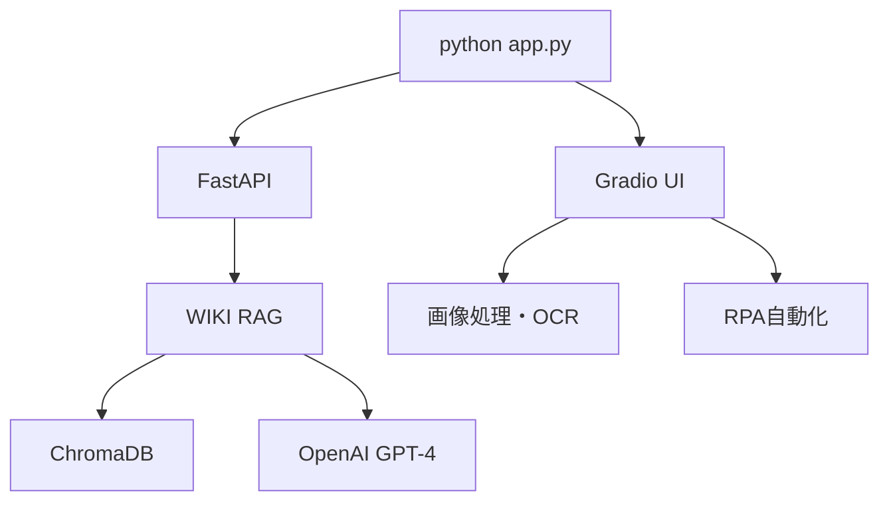

# � Issue #10: 方針転換 - メインシステム（python app.py）100%完成に集中

## 📋 **2025年06月16日 - 重要な方針転換**

### 🎯 **新方針: 一点集中主義**
> **miyataken999の判断**: "複数でなく１を１００％にしていく　このシステムがメインだからさ"

#### **旧方針** ❌
- Laravel + Python 両方開発
- 複数技術スタック並行
- 分散した開発リソース

#### **新方針** ✅  
- **メインシステム（`python app.py`）を100%完成**
- 一つのシステムに集中投資
- 確実な完成を目指す

### � **メインシステムの現状**

#### **実行コマンド**
```bash
python app.py
```

#### **システム構成**
- **メインアプリ**: `app.py` - FastAPI + Gradio統合
- **WIKI RAG**: ChromaDB + OpenAI GPT-4ナレッジベース
- **AI機能**: 画像解析、OCR、RPA自動化
- **データベース**: SQLite + ChromaDB
- **UI**: Gradio Web Interface

### ✅ **完了済み機能**
- ✅ WIKI RAGシステム (94文書)
- ✅ 画像取得・分析 (Issue #5完了)
- ✅ OCR + RPA自動化
- ✅ Gradio Web UI
- ✅ ChromaDB ナレッジベース
- ✅ AI記憶復元システム

### 🔧 **100%完成への残作業**

#### **高優先度**
- [ ] `python app.py` 動作安定性100%達成
- [ ] エラーハンドリング完全対応
- [ ] パフォーマンス最適化
- [ ] UI/UX改善・完成

#### **中優先度**
- FastAPI サーバーとの接続確認
- WikiRagService の API呼び出しテスト
- [ ] ドキュメント・ガイド完成
- [ ] テストケース拡充
- [ ] 本格運用準備

#### **低優先度（後回し）**
- [ ] Laravel版開発（一旦保留）
- [ ] 他技術スタック検討（保留）
- [ ] 複数フレームワーク対応（保留）

## � **メインシステム（python app.py）の技術スタック**

### **アーキテクチャ**


### **主要コンポーネント**
- **`app.py`**: メインアプリケーション
- **FastAPI**: REST API層
- **Gradio**: Web UI フロントエンド
- **ChromaDB**: ベクトルデータベース（94文書）
- **OpenAI**: AI推論エンジン
- **RPA**: デスクトップ自動化

## 🎯 **100%完成への具体的計画**

### **Phase 1: 安定性確保 (今日)**
```bash
# 1. 現状確認
python app.py

# 2. エラー・警告全対応
# 3. 基本機能動作100%確認
```

### **Phase 2: 機能完成 (今週)**
- [ ] 全機能動作テスト
- [ ] パフォーマンス最適化
- [ ] UI/UX改善
- [ ] エラーハンドリング強化

### **Phase 3: 完璧化 (今月)**
- [ ] ドキュメント完全版
- [ ] 本格運用対応
- [ ] オープンソース公開準備

## 💡 **集中開発の理由・メリット**

### **✅ 一点集中の利点**
1. **確実な完成**: 100%動作するシステム
2. **深い理解**: 一つのシステムを完全習得
3. **高品質**: 細部まで磨き上げ可能
4. **運用可能**: 実際に使えるレベル

### **❌ 分散開発の問題点**
1. **未完成多発**: どれも中途半端
2. **知識分散**: 各技術の理解が浅い
3. **メンテ負荷**: 複数システムの保守コスト
4. **矛盾発生**: 人間の記憶・判断ミス

## 🔄 **記憶引継ぎ情報（更新版）**

### **重要な方針転換**
**日時**: 2025年06月16日  
**決定者**: miyataken999 (プロジェクトオーナー)  
**方針**: Laravel開発一旦停止、メインシステム100%完成に集中

### **優先順位**
1. **最高優先**: `python app.py` 100%完成
2. **保留**: Laravel版 (samples/laravel-wiki-rag/)
3. **保留**: 他技術検討

### **成功指標**
- [ ] `python app.py` エラーゼロ
- [ ] 全機能動作確認済み
- [ ] 本格運用開始
- [ ] ドキュメント完成

## 📝 **新チェックリスト**

### **最優先タスク**
- [ ] `python app.py` 起動・動作確認
- [ ] エラー・警告の完全解決
- [ ] WIKI RAG機能テスト
- [ ] UI動作確認

### **完成への道筋**
- [ ] 機能追加・改善
- [ ] パフォーマンス最適化
- [ ] ドキュメント作成
- [ ] 本格運用開始

---

**方針転換日**: 2025年06月16日  
**新ステータス**: 🎯 メインシステム100%完成に集中  
**次のアクション**: `python app.py` 動作確認・改善

**重要**: この方針転換により、確実に動作するシステムを一つ完成させることで、プロジェクト全体の価値を最大化する。
