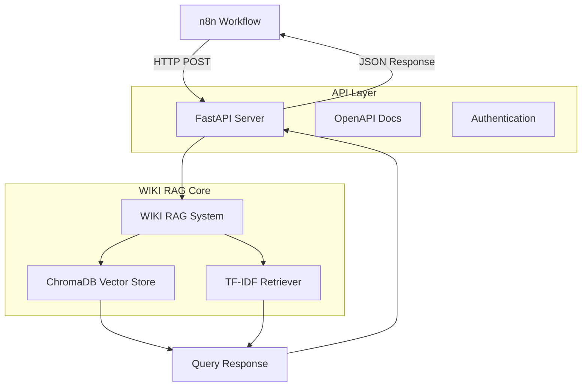

# 🚀 WIKI RAG FastAPI統合とn8n連携実装

## 📋 概要
構築済みのWIKI RAGシステム（ChromaDB + TF-IDF）をFastAPI経由でAPI化し、n8nワークフローとの連携を実現する。

## 🎯 目標
- [x] WIKI RAGシステム基盤完成（ChromaDB + TF-IDF）
- [ ] FastAPI RESTfulエンドポイント実装
- [ ] n8n Webhook連携対応
- [ ] API仕様書作成（OpenAPI/Swagger）
- [ ] Docker化とデプロイ準備
- [ ] パフォーマンステスト実施

## 🔧 技術スタック


## 📚 実装タスク

### Phase 1: FastAPI基盤構築
- [ ] `wiki_rag_api.py` 作成
- [ ] `/query` エンドポイント実装
- [ ] `/health` ヘルスチェック追加
- [ ] `/docs` Swagger UI設定
- [ ] エラーハンドリング実装

### Phase 2: n8n連携対応
- [ ] Webhook受信エンドポイント
- [ ] リクエスト形式標準化
- [ ] レスポンス形式最適化
- [ ] 認証・セキュリティ対応

### Phase 3: 高度化・運用対応
- [ ] 非同期処理対応
- [ ] キャッシュ機能追加
- [ ] ログ・モニタリング
- [ ] Docker Compose設定

## 🛠️ API仕様設計

### エンドポイント設計
```yaml
# OpenAPI 3.0 設計案
paths:
  /api/v1/query:
    post:
      summary: "WIKI RAG クエリ実行"
      requestBody:
        content:
          application/json:
            schema:
              type: object
              properties:
                query:
                  type: string
                  example: "Pythonの基本的な使い方は？"
                max_results:
                  type: integer
                  default: 5
                threshold:
                  type: float
                  default: 0.3
      responses:
        200:
          description: "クエリ成功"
          content:
            application/json:
              schema:
                type: object
                properties:
                  query:
                    type: string
                  results:
                    type: array
                    items:
                      type: object
                      properties:
                        content:
                          type: string
                        score:
                          type: float
                        metadata:
                          type: object
```

### n8n連携例
```json
{
  "webhook_url": "http://localhost:8000/api/v1/query",
  "method": "POST",
  "headers": {
    "Content-Type": "application/json",
    "Authorization": "Bearer {{token}}"
  },
  "body": {
    "query": "{{$node.Webhook.json.question}}",
    "max_results": 3
  }
}
```

## 📂 ファイル構成
```
scripts/
├── wiki_rag_api.py          # FastAPI メインアプリ
├── api/
│   ├── __init__.py
│   ├── endpoints.py         # API エンドポイント
│   ├── models.py           # Pydantic モデル
│   └── middleware.py       # 認証・CORS等
├── wiki_rag_system.py      # 既存システム（流用）
└── requirements_api.txt    # API用依存関係
```

## 🧪 テスト計画

### 単体テスト
- [ ] API エンドポイントテスト
- [ ] リクエスト/レスポンス検証
- [ ] エラーケーステスト

### 統合テスト
- [ ] n8n連携テスト
- [ ] パフォーマンステスト
- [ ] セキュリティテスト

## 📈 成功指標
- [ ] API レスポンス時間 < 2秒
- [ ] n8n連携成功率 > 99%
- [ ] API ドキュメント完備
- [ ] Docker化完了

## 🔄 進行予定
1. **Week 1**: FastAPI基盤構築・基本エンドポイント
2. **Week 2**: n8n連携・認証機能
3. **Week 3**: テスト・ドキュメント・Docker化
4. **Week 4**: 本番デプロイ・監視体制

## 💡 補足・メモ
- 既存の `wiki_rag_system.py` を最大限活用
- Gradio UI は並行稼働可能な設計
- 将来的にはGraphQL対応も検討
- OpenTelemetry等での可観測性向上

## 🔗 関連Issue・PR
- Issue #8: WIKI RAGシステム構築完了
- 関連ドキュメント: `docs/reports/WIKI_RAG_SYSTEM_COMPLETION_REPORT.md`

---
**Labels**: `enhancement`, `api`, `n8n`, `fastapi`, `integration`  
**Assignee**: AI-CEO  
**Milestone**: Q2 2024 API Integration
