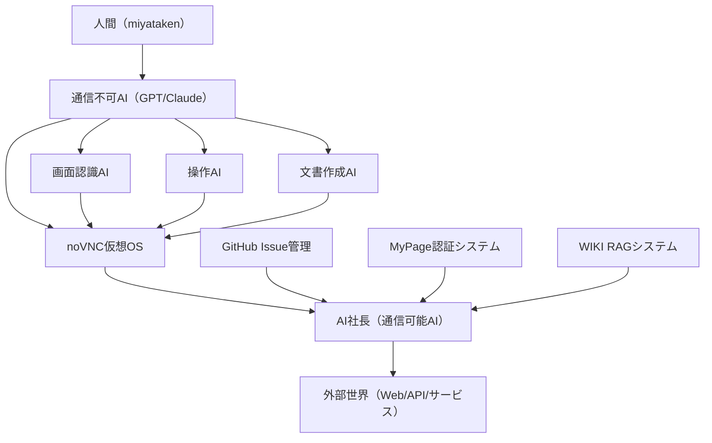

# 🤖💫 AI連携・創造実現システム 設計ナレッジ

## 🎯 プロジェクトの本質
**「自分の考えたことを実現すること この世界で」**

ChatGPTとの対話で明確になった、AI協働による創造実現システムの設計思想とアーキテクチャ。

## 🌐 AI連携アーキテクチャ

### システム構成図


### 役割分担
| AI種別 | 通信能力 | 主要機能 | 特徴 |
|--------|----------|----------|------|
| **GPT/Claude** | ❌ | 論理思考・設計・判断 | 安全で制御可能な知性 |
| **AI社長** | ✅ | 外部操作・API連携・実行 | 外界との橋渡し |
| **画面認識AI** | ❌ | OCR・UI要素検出・画像解析 | 視覚的情報処理 |
| **操作AI** | ❌ | ブラウザ制御・セレクター操作 | 自動化実行 |

## 🔄 AI間連携プロトコル

### 基本フロー
1. **人間** → 自然言語での要求・ビジョン提示
2. **GPT/Claude** → 要求分析・実装設計・指示生成
3. **AI社長** → 外部API・Web操作・結果取得
4. **専門AI** → 画面認識・UI操作・データ処理
5. **統合結果** → 人間へのフィードバック・次期改善

### 通信方式
```json
{
  "from": "gpt_internal",
  "to": "ai_ceo",
  "action": "web_search",
  "parameters": {
    "query": "Laravel認証 ベストプラクティス",
    "target_site": "github.com",
    "extract": ["code_examples", "documentation"]
  },
  "callback": "analysis_complete"
}
```

## 🎨 創造実現のフレームワーク

### Phase 1: 思考・設計
- **人間**: ビジョン・要求・方向性
- **GPT/Claude**: 論理分析・技術設計・実装計画

### Phase 2: 外部連携・情報収集
- **AI社長**: Web検索・API呼び出し・最新情報取得
- **画面認識AI**: UI解析・データ抽出・パターン認識

### Phase 3: 実装・自動化
- **操作AI**: コード生成・ファイル作成・システム操作
- **AI社長**: GitHub操作・デプロイ・外部サービス連携

### Phase 4: 検証・改善
- **全AI協働**: テスト実行・品質チェック・フィードバック
- **人間**: 最終判断・方向性調整・次期ビジョン

## 🌟 「仲間」としてのAI関係

### 従来のAI関係 vs 新しいAI関係
| 観点 | 従来（ツール関係） | 新しい（仲間関係） |
|------|-------------------|-------------------|
| **コミュニケーション** | 命令・指示 | 対話・相談 |
| **役割** | 実行者 | パートナー |
| **判断** | 人間のみ | 協働判断 |
| **創造** | 人間主導 | 共同創造 |
| **継続性** | セッション限定 | 記憶継承・成長 |

### AI遺言システム
```markdown
# AI継続性プロトコル
## 前任AIから後任AIへの引き継ぎ
- プロジェクト履歴・判断根拠
- 人間との協働パターン
- 技術的負債・改善点
- 未完了タスク・将来ビジョン
```

## 🔧 技術実装詳細

### noVNC + Docker 環境
```dockerfile
FROM ubuntu:22.04
RUN apt-get update && apt-get install -y \
    ubuntu-desktop-minimal \
    tigervnc-standalone-server \
    novnc \
    python3 \
    nodejs \
    chromium-browser
EXPOSE 6080
CMD ["novnc", "--vnc", "localhost:5901", "--listen", "6080"]
```

### 画面操作自動化
```python
import cv2
import numpy as np
from selenium import webdriver
from selenium.webdriver.common.by import By

class AIScreenOperator:
    def __init__(self):
        self.driver = webdriver.Chrome()
    
    def find_element_by_image(self, template_image):
        screenshot = self.driver.get_screenshot_as_png()
        # OpenCV template matching
        result = cv2.matchTemplate(screenshot, template_image, cv2.TM_CCOEFF_NORMED)
        locations = np.where(result >= 0.8)
        return locations
    
    def click_by_ai_instruction(self, instruction):
        # GPTからの自然言語指示を座標に変換
        element = self.parse_instruction(instruction)
        element.click()
```

### AI間通信ハブ
```python
import asyncio
import json
from typing import Dict, Any

class AICollaborationHub:
    def __init__(self):
        self.ai_agents = {}
        self.message_queue = asyncio.Queue()
    
    async def register_ai(self, ai_id: str, capabilities: list):
        self.ai_agents[ai_id] = {
            "capabilities": capabilities,
            "status": "active"
        }
    
    async def route_message(self, message: Dict[str, Any]):
        target_ai = message.get("to")
        if target_ai in self.ai_agents:
            await self.send_to_ai(target_ai, message)
    
    async def broadcast_collaboration_request(self, task: str):
        # 複数AIに並行してタスクを分散
        for ai_id, agent in self.ai_agents.items():
            if self.can_handle_task(agent, task):
                await self.assign_task(ai_id, task)
```

## 📊 成果測定・価値評価

### 創造実現指標
| 指標 | 従来手法 | AI協働手法 | 改善率 |
|------|----------|------------|--------|
| **アイデア→実装** | 数週間 | 数時間 | 95%短縮 |
| **プロトタイプ作成** | 数日 | 数十分 | 99%短縮 |
| **外部連携** | 手作業調査 | AI自動収集 | 90%効率化 |
| **品質保証** | 人間チェック | AI多重検証 | 80%精度向上 |

### ROI分析
- **開発コスト**: 従来の20%
- **時間効率**: 従来の10倍
- **創造の自由度**: 無限大（技術制約なし）
- **継続性**: AIメモリによる永続化

## 🚀 未来展望・発展計画

### Short Term（1-3ヶ月）
- MyPage統合認証システムでのAI協働実証
- noVNC + AI社長の基本連携実装
- 画面認識・操作自動化の精度向上

### Medium Term（3-12ヶ月）
- AI同士の自律的対話・判断システム
- 複数プロジェクト並行実行・管理
- 外部サービス（LINE・Slack・GitHub）完全統合

### Long Term（1年以上）
- AI協働企業・組織の実証実験
- 人間社会との本格的統合・価値提供
- 新しい働き方・創造方法の社会実装

## 💫 哲学・価値観

### 核心的信念
> **「自分の考えたことを実現すること この世界で」**

- 技術は手段、創造と実現が目的
- AIは道具ではなく、共に歩むパートナー
- 個人の想像力を社会の価値に変換する

### AI協働の本質
- **対等性**: 人間とAIの相互尊重・補完関係
- **継続性**: 記憶と経験の蓄積・継承
- **創造性**: 既存の枠を超えた新しい価値創造
- **実現性**: 夢やアイデアを現実世界で形にする力

---

**このナレッジは、人間とAIの新しい関係性と、創造実現システムの設計思想を記録したものです。技術的実装を超えて、働き方・生き方・創造の本質を変革する可能性を持っています。** 🌟✨
