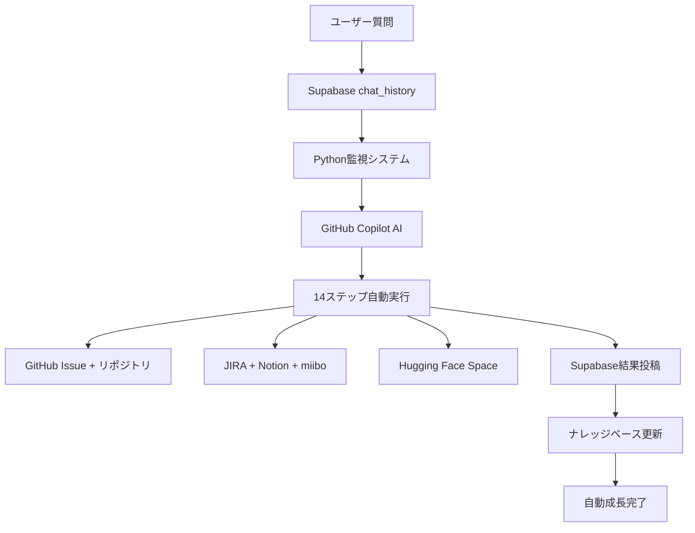

# AI自動開発パイプライン完全版ナレッジ

## 📋 概要
GitHub Copilot連携による完全自動開発システム。チャット質問 → AI実装 → ナレッジ蓄積のサイクルで自動成長。

## 🎯 システム構成

### 1. 自動監視システム
- **ファイル**: `tests/Feature/copilot_direct_answer_fixed.py`
- **機能**: Supabaseから新着質問を3秒間隔で監視
- **起動**: `python copilot_direct_answer_fixed.py --auto`

### 2. 完全自動開発フロー（14ステップ）
1. 詳細な回答生成
2. GitHub Issue作成
3. プロジェクトフォルダー作成
4. プログラム自動実装
5. 独立リポジトリ作成
6. サブモジュール化
7. GitHub Issue更新
8. n8nワークフロー作成
9. JIRAチケット作成
10. Notionナレッジ登録
11. miiboナレッジ登録
12. Hugging Face Space作成
13. Supabase結果投稿
14. 最終Git Push

### 3. ナレッジ蓄積システム
- **会話履歴**: `conversation_logs/`
- **技術ナレッジ**: `knowledge_base/`
- **Supabaseナレッジベース**: `chat_history`テーブル
- **Notion統合**: 自動ページ作成

## 🚀 動作フロー



## 💡 ナレッジ自動成長のメカニズム

### 学習サイクル
1. **質問受信**: ユーザーからの技術質問
2. **AI処理**: GitHub Copilotが完全実装
3. **成果保存**: GitHub, Notion, Supabaseに記録
4. **ナレッジ化**: 技術パターンが蓄積
5. **再利用**: 次回の類似質問で活用

### 成長ポイント
- **実装パターン**: React, Python, API統合手法
- **問題解決**: エラー対処、最適化手法
- **ベストプラクティス**: 設定管理、セキュリティ
- **プロジェクト構成**: フォルダ構造、ファイル命名

## ⚙️ 設定と起動

### 環境変数 (.env)
```env
# Supabase
SUPABASE_URL=https://rootomzbucovwdqsscqd.supabase.co
SUPABASE_KEY=your_supabase_key

# GitHub
GITHUB_TOKEN=your_github_token

# API統合
NOTION_TOKEN=your_notion_token
JIRA_API_TOKEN=your_jira_token
MIIBO_API_KEY=your_miibo_key
HF_TOKEN=your_huggingface_token
N8N_API_KEY=your_n8n_key
```

### 起動コマンド
```bash
# 完全自動監視モード
python tests/Feature/copilot_direct_answer_fixed.py --auto

# ナレッジ保存
python save_knowledge.py

# 会話履歴保存
python save_conversation.py
```

## 🎉 期待される成果

### 短期的効果
- **即座の問題解決**: 質問に対する完全実装
- **GitHub自動管理**: Issue, リポジトリの自動作成
- **ドキュメント化**: Notion, JIRAの自動更新

### 長期的効果
- **技術ナレッジ蓄積**: 実装パターンの自動収集
- **開発効率向上**: 類似問題の高速解決
- **チーム知識共有**: ベストプラクティスの自動継承
- **AI学習促進**: Copilotとの協調学習

## 🔧 カスタマイズポイント

### 監視間隔
```python
system.infinite_auto_loop(3)  # 3秒間隔
```

### 対象チャット座標
```python
self.chat_coordinates = {'x': 1335, 'y': 1045}
```

### 自動実行ステップ
```python
# 14ステップの有効/無効を制御可能
enable_github_issue = True
enable_notion_save = True
enable_huggingface = True
```

## 📊 ナレッジ活用例

### 技術パターン検索
```sql
SELECT * FROM chat_history 
WHERE ownerid = 'GitHub-Copilot-AI-Knowledge'
AND messages LIKE '%React%'
ORDER BY created DESC;
```

### 実装履歴参照
```bash
# 過去のプロジェクト一覧
ls packages/*/README.md

# 特定技術の実装例
grep -r "TypeScript" knowledge_base/
```

## 🚀 次世代発展

### AI学習統合
- **Copilot学習**: 過去の実装パターンから学習
- **自動改善**: エラーパターンの自動回避
- **予測実装**: 質問から必要技術を予測

### スケール展開
- **マルチプロジェクト**: 複数リポジトリ同時管理
- **チーム統合**: 複数開発者の知識統合
- **API拡張**: 新しいサービス統合の自動化

## 🎯 実用化のメリット

1. **完全ハンズフリー**: 質問するだけで実装完了
2. **継続的学習**: 使うほどに賢くなるシステム
3. **知識の永続化**: 重要な技術情報の自動保存
4. **チーム効率化**: 個人知識をチーム資産に変換
5. **技術債務削減**: ベストプラクティスの自動適用

このシステムによって、技術的な質問や課題が **自動的にナレッジとして蓄積・活用** される持続可能な開発環境が実現します！🎉
