# 🗄️ MyPage統合認証システム データベース設計

## 📊 ER図

```mermaid
erDiagram
    USERS {
        bigint id PK
        string uuid UK "ユニークID"
        string email UK "メールアドレス"
        string name "表示名"
        string phone "電話番号"
        datetime email_verified_at "メール認証日時"
        datetime created_at
        datetime updated_at
        datetime deleted_at "論理削除"
    }
    
    USER_PROFILES {
        bigint id PK
        bigint user_id FK
        string first_name "姓"
        string last_name "名"
        string first_name_kana "姓（カナ）"
        string last_name_kana "名（カナ）"
        date birth_date "生年月日"
        enum gender "性別"
        string postal_code "郵便番号"
        string address "住所"
        string avatar_url "アバター画像URL"
        json preferences "設定情報"
        datetime created_at
        datetime updated_at
    }
    
    AUTH_PROVIDERS {
        bigint id PK
        bigint user_id FK
        enum provider_type "認証プロバイダー種別"
        string provider_id "プロバイダーユーザーID"
        string provider_email "プロバイダーメール"
        json provider_data "プロバイダー追加データ"
        string access_token "アクセストークン"
        string refresh_token "リフレッシュトークン"
        datetime token_expires_at "トークン有効期限"
        boolean is_primary "メイン認証フラグ"
        datetime created_at
        datetime updated_at
    }
    
    IDENTITY_VERIFICATIONS {
        bigint id PK
        bigint user_id FK
        enum verification_type "認証種別"
        enum status "認証ステータス"
        string trustdock_user_id "TrustDockユーザーID"
        string verification_id "認証ID"
        json verification_data "認証データ"
        json documents "提出書類情報"
        datetime verified_at "認証完了日時"
        datetime expires_at "認証有効期限"
        text notes "備考"
        datetime created_at
        datetime updated_at
    }
    
    USER_SESSIONS {
        string id PK "セッションID"
        bigint user_id FK
        string ip_address "IPアドレス"
        text user_agent "ユーザーエージェント"
        text payload "セッションデータ"
        integer last_activity "最終アクティビティ"
        datetime created_at
    }
    
    RESERVATIONS {
        bigint id PK
        bigint user_id FK
        string reservation_number UK "予約番号"
        enum service_type "サービス種別"
        datetime reserved_at "予約日時"
        enum status "予約ステータス"
        json reservation_data "予約詳細"
        decimal amount "金額"
        text notes "備考"
        datetime created_at
        datetime updated_at
        datetime cancelled_at "キャンセル日時"
    }
    
    WIKI_RAG_QUERIES {
        bigint id PK
        bigint user_id FK
        text query "クエリ内容"
        json results "検索結果"
        decimal response_time "応答時間"
        integer result_count "結果件数"
        string session_id "セッションID"
        datetime created_at
    }
    
    ACTIVITY_LOGS {
        bigint id PK
        bigint user_id FK
        string action "アクション"
        string resource "リソース"
        json data "詳細データ"
        string ip_address "IPアドレス"
        text user_agent "ユーザーエージェント"
        datetime created_at
    }

    USERS ||--|| USER_PROFILES : "has profile"
    USERS ||--o{ AUTH_PROVIDERS : "has multiple auth methods"
    USERS ||--o{ IDENTITY_VERIFICATIONS : "has verifications"
    USERS ||--o{ USER_SESSIONS : "has sessions"
    USERS ||--o{ RESERVATIONS : "makes reservations"
    USERS ||--o{ WIKI_RAG_QUERIES : "performs queries"
    USERS ||--o{ ACTIVITY_LOGS : "generates logs"
```



## 📋 テーブル詳細設計

### 1. users（ユーザー基本情報）
```sql
CREATE TABLE users (
    id BIGINT UNSIGNED AUTO_INCREMENT PRIMARY KEY,
    uuid CHAR(36) NOT NULL UNIQUE COMMENT 'UUID',
    email VARCHAR(255) NOT NULL UNIQUE COMMENT 'メールアドレス',
    name VARCHAR(255) NOT NULL COMMENT '表示名',
    phone VARCHAR(20) NULL COMMENT '電話番号',
    email_verified_at TIMESTAMP NULL COMMENT 'メール認証日時',
    created_at TIMESTAMP DEFAULT CURRENT_TIMESTAMP,
    updated_at TIMESTAMP DEFAULT CURRENT_TIMESTAMP ON UPDATE CURRENT_TIMESTAMP,
    deleted_at TIMESTAMP NULL COMMENT '論理削除',
    
    INDEX idx_email (email),
    INDEX idx_uuid (uuid),
    INDEX idx_deleted_at (deleted_at)
) COMMENT='ユーザー基本情報';
```

### 2. user_profiles（ユーザープロフィール）
```sql
CREATE TABLE user_profiles (
    id BIGINT UNSIGNED AUTO_INCREMENT PRIMARY KEY,
    user_id BIGINT UNSIGNED NOT NULL,
    first_name VARCHAR(50) NULL COMMENT '姓',
    last_name VARCHAR(50) NULL COMMENT '名',
    first_name_kana VARCHAR(50) NULL COMMENT '姓（カナ）',
    last_name_kana VARCHAR(50) NULL COMMENT '名（カナ）',
    birth_date DATE NULL COMMENT '生年月日',
    gender ENUM('male', 'female', 'other', 'prefer_not_to_say') NULL COMMENT '性別',
    postal_code VARCHAR(10) NULL COMMENT '郵便番号',
    address TEXT NULL COMMENT '住所',
    avatar_url VARCHAR(500) NULL COMMENT 'アバター画像URL',
    preferences JSON NULL COMMENT '設定情報',
    created_at TIMESTAMP DEFAULT CURRENT_TIMESTAMP,
    updated_at TIMESTAMP DEFAULT CURRENT_TIMESTAMP ON UPDATE CURRENT_TIMESTAMP,
    
    FOREIGN KEY (user_id) REFERENCES users(id) ON DELETE CASCADE,
    UNIQUE KEY uk_user_id (user_id)
) COMMENT='ユーザープロフィール';
```

### 3. auth_providers（認証プロバイダー）
```sql
CREATE TABLE auth_providers (
    id BIGINT UNSIGNED AUTO_INCREMENT PRIMARY KEY,
    user_id BIGINT UNSIGNED NOT NULL,
    provider_type ENUM('line', 'firebase_email', 'firebase_google', 'firebase_twitter', 'trustdock') NOT NULL COMMENT '認証プロバイダー種別',
    provider_id VARCHAR(255) NOT NULL COMMENT 'プロバイダーユーザーID',
    provider_email VARCHAR(255) NULL COMMENT 'プロバイダーメール',
    provider_data JSON NULL COMMENT 'プロバイダー追加データ',
    access_token TEXT NULL COMMENT 'アクセストークン',
    refresh_token TEXT NULL COMMENT 'リフレッシュトークン',
    token_expires_at TIMESTAMP NULL COMMENT 'トークン有効期限',
    is_primary BOOLEAN DEFAULT FALSE COMMENT 'メイン認証フラグ',
    created_at TIMESTAMP DEFAULT CURRENT_TIMESTAMP,
    updated_at TIMESTAMP DEFAULT CURRENT_TIMESTAMP ON UPDATE CURRENT_TIMESTAMP,
    
    FOREIGN KEY (user_id) REFERENCES users(id) ON DELETE CASCADE,
    UNIQUE KEY uk_provider_user (provider_type, provider_id),
    INDEX idx_user_provider (user_id, provider_type)
) COMMENT='認証プロバイダー';
```

### 4. identity_verifications（本人確認）
```sql
CREATE TABLE identity_verifications (
    id BIGINT UNSIGNED AUTO_INCREMENT PRIMARY KEY,
    user_id BIGINT UNSIGNED NOT NULL,
    verification_type ENUM('basic', 'advanced', 'bank_account', 'address') NOT NULL COMMENT '認証種別',
    status ENUM('pending', 'processing', 'approved', 'rejected', 'expired') NOT NULL DEFAULT 'pending' COMMENT '認証ステータス',
    trustdock_user_id VARCHAR(255) NULL COMMENT 'TrustDockユーザーID',
    verification_id VARCHAR(255) NULL COMMENT '認証ID',
    verification_data JSON NULL COMMENT '認証データ',
    documents JSON NULL COMMENT '提出書類情報',
    verified_at TIMESTAMP NULL COMMENT '認証完了日時',
    expires_at TIMESTAMP NULL COMMENT '認証有効期限',
    notes TEXT NULL COMMENT '備考',
    created_at TIMESTAMP DEFAULT CURRENT_TIMESTAMP,
    updated_at TIMESTAMP DEFAULT CURRENT_TIMESTAMP ON UPDATE CURRENT_TIMESTAMP,
    
    FOREIGN KEY (user_id) REFERENCES users(id) ON DELETE CASCADE,
    INDEX idx_user_verification (user_id, verification_type),
    INDEX idx_status (status),
    INDEX idx_trustdock_user (trustdock_user_id)
) COMMENT='本人確認';
```

### 5. user_sessions（ユーザーセッション）
```sql
CREATE TABLE user_sessions (
    id VARCHAR(255) PRIMARY KEY COMMENT 'セッションID',
    user_id BIGINT UNSIGNED NULL,
    ip_address VARCHAR(45) NULL COMMENT 'IPアドレス',
    user_agent TEXT NULL COMMENT 'ユーザーエージェント',
    payload LONGTEXT NOT NULL COMMENT 'セッションデータ',
    last_activity INT UNSIGNED NOT NULL COMMENT '最終アクティビティ',
    created_at TIMESTAMP DEFAULT CURRENT_TIMESTAMP,
    
    FOREIGN KEY (user_id) REFERENCES users(id) ON DELETE CASCADE,
    INDEX idx_user_id (user_id),
    INDEX idx_last_activity (last_activity)
) COMMENT='ユーザーセッション';
```

### 6. reservations（予約管理）
```sql
CREATE TABLE reservations (
    id BIGINT UNSIGNED AUTO_INCREMENT PRIMARY KEY,
    user_id BIGINT UNSIGNED NOT NULL,
    reservation_number VARCHAR(20) NOT NULL UNIQUE COMMENT '予約番号',
    service_type ENUM('consultation', 'support', 'maintenance', 'other') NOT NULL COMMENT 'サービス種別',
    reserved_at TIMESTAMP NOT NULL COMMENT '予約日時',
    status ENUM('pending', 'confirmed', 'completed', 'cancelled', 'no_show') NOT NULL DEFAULT 'pending' COMMENT '予約ステータス',
    reservation_data JSON NULL COMMENT '予約詳細',
    amount DECIMAL(10,2) UNSIGNED NULL COMMENT '金額',
    notes TEXT NULL COMMENT '備考',
    created_at TIMESTAMP DEFAULT CURRENT_TIMESTAMP,
    updated_at TIMESTAMP DEFAULT CURRENT_TIMESTAMP ON UPDATE CURRENT_TIMESTAMP,
    cancelled_at TIMESTAMP NULL COMMENT 'キャンセル日時',
    
    FOREIGN KEY (user_id) REFERENCES users(id) ON DELETE CASCADE,
    INDEX idx_user_reservation (user_id, reserved_at),
    INDEX idx_status (status),
    INDEX idx_reservation_number (reservation_number)
) COMMENT='予約管理';
```

### 7. wiki_rag_queries（WIKI RAGクエリ履歴）
```sql
CREATE TABLE wiki_rag_queries (
    id BIGINT UNSIGNED AUTO_INCREMENT PRIMARY KEY,
    user_id BIGINT UNSIGNED NOT NULL,
    query TEXT NOT NULL COMMENT 'クエリ内容',
    results JSON NULL COMMENT '検索結果',
    response_time DECIMAL(8,3) UNSIGNED NULL COMMENT '応答時間（秒）',
    result_count INT UNSIGNED NULL COMMENT '結果件数',
    session_id VARCHAR(255) NULL COMMENT 'セッションID',
    created_at TIMESTAMP DEFAULT CURRENT_TIMESTAMP,
    
    FOREIGN KEY (user_id) REFERENCES users(id) ON DELETE CASCADE,
    INDEX idx_user_query (user_id, created_at),
    INDEX idx_session (session_id),
    FULLTEXT INDEX ft_query (query)
) COMMENT='WIKI RAGクエリ履歴';
```

### 8. activity_logs（アクティビティログ）
```sql
CREATE TABLE activity_logs (
    id BIGINT UNSIGNED AUTO_INCREMENT PRIMARY KEY,
    user_id BIGINT UNSIGNED NULL,
    action VARCHAR(50) NOT NULL COMMENT 'アクション',
    resource VARCHAR(50) NOT NULL COMMENT 'リソース',
    data JSON NULL COMMENT '詳細データ',
    ip_address VARCHAR(45) NULL COMMENT 'IPアドレス',
    user_agent TEXT NULL COMMENT 'ユーザーエージェント',
    created_at TIMESTAMP DEFAULT CURRENT_TIMESTAMP,
    
    FOREIGN KEY (user_id) REFERENCES users(id) ON DELETE SET NULL,
    INDEX idx_user_activity (user_id, created_at),
    INDEX idx_action_resource (action, resource),
    INDEX idx_created_at (created_at)
) COMMENT='アクティビティログ';
```

## 🔄 マイグレーション順序

1. `users` (基本テーブル)
2. `user_profiles` 
3. `auth_providers`
4. `identity_verifications`
5. `user_sessions`
6. `reservations`
7. `wiki_rag_queries`
8. `activity_logs`

## 🛡️ セキュリティ設計

### データ暗号化
- **個人情報**: AES-256で暗号化
- **トークン**: ハッシュ化して保存
- **ログ**: 個人情報マスキング

### アクセス制御
- **Row Level Security**: ユーザー自身のデータのみアクセス可能
- **API Rate Limiting**: ユーザー毎のAPI呼び出し制限
- **IP制限**: 管理機能は特定IPからのみアクセス

### データ保持ポリシー
- **セッション**: 1ヶ月で自動削除
- **ログ**: 1年で自動削除  
- **認証トークン**: 期限切れで自動削除

## 📈 パフォーマンス最適化

### インデックス戦略
- **複合インデックス**: よく使われるクエリパターンに最適化
- **部分インデックス**: 条件付きインデックスで容量削減
- **全文検索**: WIKI RAGクエリの高速検索

### パーティショニング
- **日付ベース**: ログテーブルの月次パーティション
- **ユーザーベース**: 大量ユーザー時のシャーディング準備

---

これで基盤のデータベース設計完成！💪

次は、このスキーマに基づいたLaravelのMigrationファイルとModelを作成しようか？
