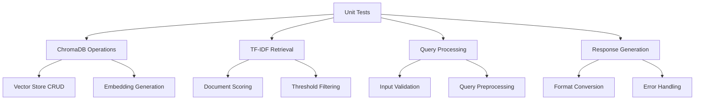
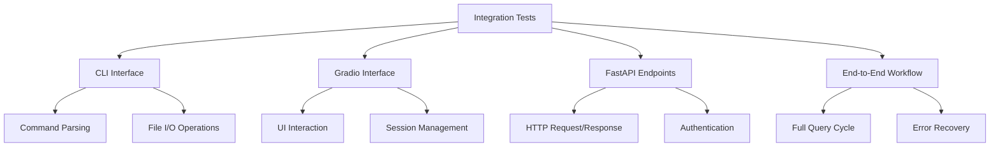
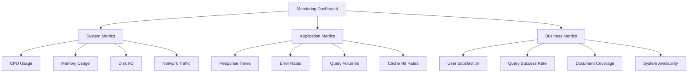

# 🧪 WIKI RAGシステム テスト・改善・運用化

## 📋 概要
構築済みのWIKI RAGシステムの品質向上、パフォーマンス最適化、運用体制整備を行い、本番環境での安定稼働を実現する。

## 🎯 目標
- [ ] 包括的テストスイート構築
- [ ] パフォーマンスベンチマーク実施
- [ ] セキュリティ監査・強化
- [ ] 監視・ログ体制整備
- [ ] CI/CD パイプライン構築
- [ ] 本番環境デプロイ準備

## 🔧 テスト戦略

### 単体テスト (Unit Tests)


### 統合テスト (Integration Tests)


## 📊 パフォーマンステスト

### ベンチマーク項目
- [ ] クエリ応答時間測定
- [ ] 同時接続数テスト
- [ ] メモリ使用量監視
- [ ] ディスク I/O 最適化
- [ ] ネットワーク遅延対応

### 性能目標
```yaml
Performance Targets:
  Response Time:
    - Simple Query: < 1 second
    - Complex Query: < 3 seconds
    - Bulk Processing: < 30 seconds
  
  Throughput:
    - Concurrent Users: > 100
    - Queries per Second: > 50
    - Document Processing: > 1000/hour
  
  Resource Usage:
    - Memory: < 2GB peak
    - CPU: < 70% average
    - Disk: < 80% capacity
```

### ベンチマークスクリプト例
```python
# scripts/benchmark_wiki_rag.py
import time
import asyncio
import statistics
from concurrent.futures import ThreadPoolExecutor
import psutil

class WikiRagBenchmark:
    def __init__(self):
        self.wiki_rag = WikiRagSystem()
        self.test_queries = [
            "Pythonの基本的な使い方",
            "機械学習アルゴリズムの種類",
            "データベース設計のベストプラクティス",
            # ... more test queries
        ]
    
    def measure_response_time(self, query, iterations=10):
        times = []
        for _ in range(iterations):
            start = time.time()
            result = self.wiki_rag.query(query)
            end = time.time()
            times.append(end - start)
        
        return {
            'mean': statistics.mean(times),
            'median': statistics.median(times),
            'min': min(times),
            'max': max(times),
            'std': statistics.stdev(times)
        }
    
    def stress_test(self, concurrent_users=50, duration=60):
        # Implementation for concurrent load testing
        pass
    
    def memory_profiling(self):
        # Memory usage analysis during operations
        pass
```

## 🔒 セキュリティ強化

### セキュリティ監査項目
- [ ] 入力値検証・サニタイゼーション
- [ ] SQLインジェクション対策
- [ ] XSS攻撃対策  
- [ ] 認証・認可機能強化
- [ ] API レート制限実装
- [ ] ログ改ざん防止

### セキュリティテスト
```python
# scripts/security_test_wiki_rag.py
class SecurityTester:
    def test_input_validation(self):
        # Test malicious input handling
        malicious_inputs = [
            "'; DROP TABLE documents; --",
            "<script>alert('xss')</script>",
            "../../../etc/passwd",
            "A" * 10000,  # Buffer overflow test
        ]
        # Implementation...
    
    def test_authentication(self):
        # Test auth bypass attempts
        pass
    
    def test_rate_limiting(self):
        # Test API rate limits
        pass
```

## 📈 監視・ログ体制

### ログ設計
```python
# Enhanced logging configuration
import logging
import structlog
from pythonjsonlogger import jsonlogger

# Structured logging setup
logging.basicConfig(
    level=logging.INFO,
    handlers=[
        logging.FileHandler('/var/log/wiki-rag/system.log'),
        logging.StreamHandler()
    ]
)

# Performance metrics logging
class PerformanceLogger:
    def __init__(self):
        self.logger = structlog.get_logger("performance")
    
    def log_query_performance(self, query, response_time, result_count):
        self.logger.info(
            "query_executed",
            query_hash=hash(query),
            response_time=response_time,
            result_count=result_count,
            timestamp=time.time()
        )
```

### 監視ダッシュボード


## 🚀 CI/CD パイプライン

### GitHub Actions ワークフロー
```yaml
# .github/workflows/wiki-rag-ci.yml
name: WIKI RAG CI/CD

on:
  push:
    branches: [ main, develop ]
  pull_request:
    branches: [ main ]

jobs:
  test:
    runs-on: ubuntu-latest
    steps:
    - uses: actions/checkout@v3
    
    - name: Setup Python
      uses: actions/setup-python@v4
      with:
        python-version: '3.9'
    
    - name: Install dependencies
      run: |
        pip install -r requirements_wiki_rag.txt
        pip install pytest pytest-cov
    
    - name: Run unit tests
      run: pytest tests/unit/ --cov=scripts/
    
    - name: Run integration tests
      run: pytest tests/integration/
    
    - name: Security scan
      run: bandit -r scripts/
    
    - name: Performance benchmark
      run: python scripts/benchmark_wiki_rag.py
  
  deploy:
    needs: test
    runs-on: ubuntu-latest
    if: github.ref == 'refs/heads/main'
    steps:
    - name: Deploy to staging
      run: echo "Deploy to staging environment"
```

## 📂 テストファイル構成
```
tests/
├── unit/
│   ├── test_wiki_rag_system.py
│   ├── test_tfidf_retriever.py
│   ├── test_chromadb_operations.py
│   └── test_query_processing.py
├── integration/
│   ├── test_cli_interface.py
│   ├── test_gradio_interface.py
│   ├── test_api_endpoints.py
│   └── test_end_to_end.py
├── performance/
│   ├── benchmark_wiki_rag.py
│   ├── stress_test.py
│   └── memory_profiling.py
├── security/
│   ├── security_test_wiki_rag.py
│   └── penetration_test.py
└── fixtures/
    ├── sample_documents.json
    ├── test_queries.json
    └── expected_results.json
```

## 🛠️ 実装タスク

### Phase 1: テスト基盤構築
- [ ] pytest設定・テストランナー構築
- [ ] テストデータ・フィクスチャ準備
- [ ] 単体テスト実装 (80%+ カバレッジ)
- [ ] 統合テスト実装
- [ ] テストレポート自動生成

### Phase 2: パフォーマンス最適化
- [ ] ベンチマークツール作成
- [ ] パフォーマンスボトルネック特定
- [ ] ChromaDB最適化設定
- [ ] TF-IDF計算高速化
- [ ] キャッシュ機能実装

### Phase 3: セキュリティ強化
- [ ] セキュリティテスト実装
- [ ] 脆弱性スキャン自動化
- [ ] 入力値検証強化
- [ ] ログ・監査機能追加

### Phase 4: 運用体制整備
- [ ] 監視ダッシュボード構築
- [ ] アラート設定
- [ ] ログ集約・分析システム
- [ ] バックアップ・復旧手順
- [ ] 運用マニュアル作成

## 📈 品質指標・KPI
- [ ] テストカバレッジ > 85%
- [ ] セキュリティスキャン合格率 100%
- [ ] 平均応答時間 < 2秒
- [ ] 可用性 > 99.5%
- [ ] エラー率 < 0.1%

## 🔄 継続的改善
- [ ] 週次パフォーマンスレビュー
- [ ] 月次セキュリティ監査
- [ ] 四半期システム最適化
- [ ] 年次アーキテクチャレビュー

## 🔗 関連Issue・ドキュメント
- Issue #8: WIKI RAGシステム構築完了
- FastAPI統合Issue (作成予定)
- 参考: `docs/reports/WIKI_RAG_SYSTEM_COMPLETION_REPORT.md`

---
**Labels**: `testing`, `performance`, `security`, `monitoring`, `ci-cd`, `quality-assurance`  
**Assignee**: AI-CEO  
**Milestone**: Q2 2024 Production Ready
