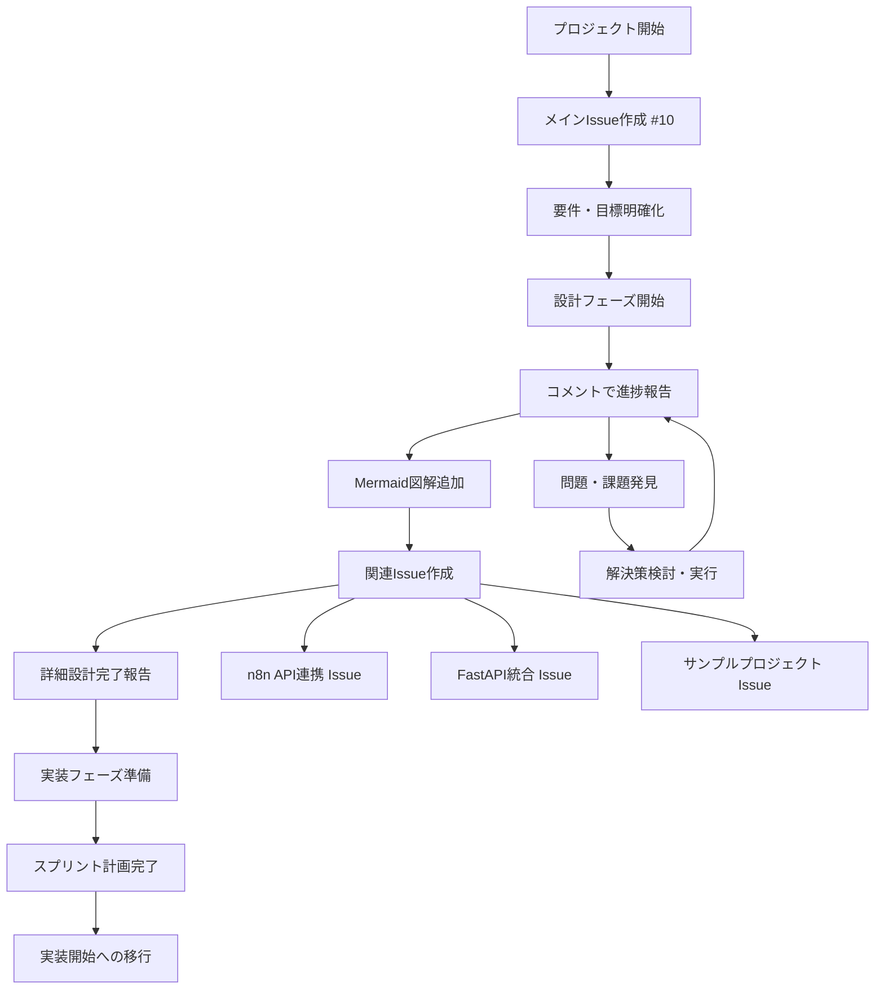
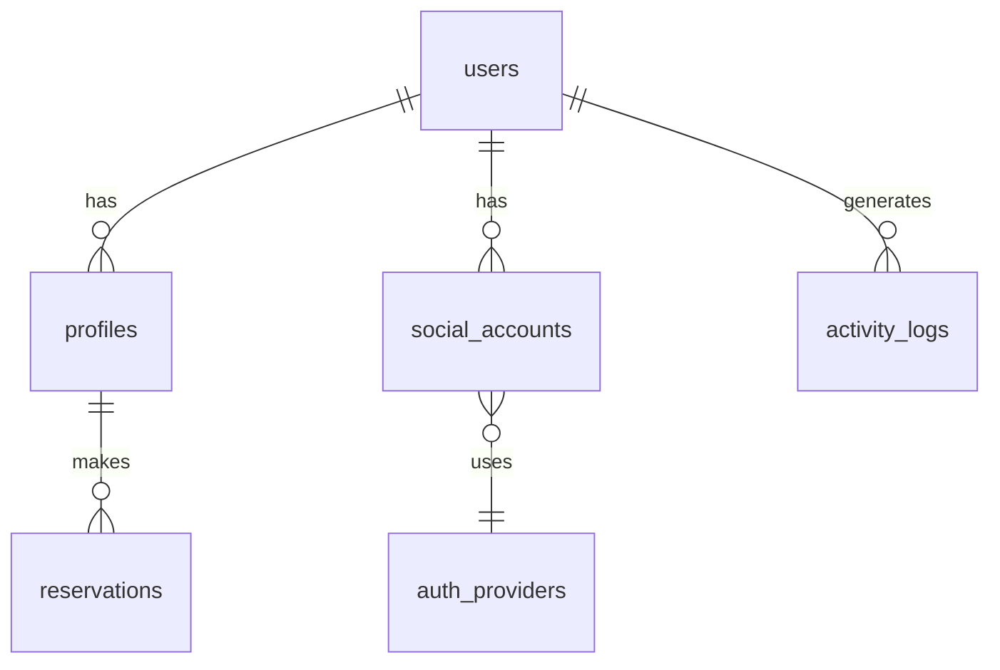
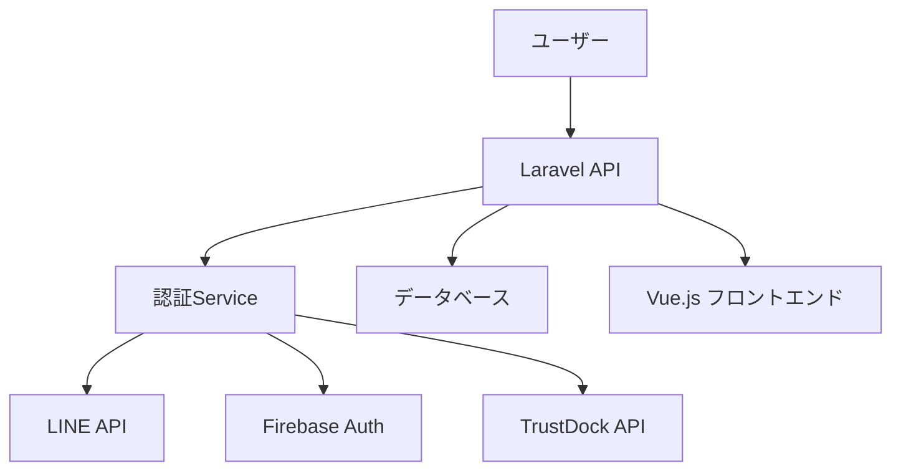
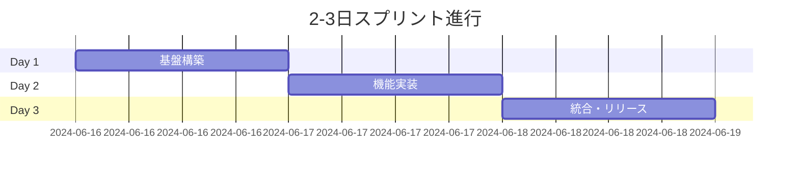

# 📖 GitHub Issue活用による効率的プロジェクト管理 Wiki

## 🎯 概要
MyPage統合認証システム開発プロジェクトにおける、GitHub Issueを活用した効率的なプロジェクト管理手法とその成果をまとめたWikiドキュメント。

## 📋 Issue管理の流れ・ベストプラクティス

### 🌟 今回の成功パターン
1. **メインIssue #10作成** → 全体統括・進捗可視化
2. **逐次コメント報告** → リアルタイム進捗共有
3. **Mermaid図解活用** → 技術仕様の視覚的説明
4. **関連Issue分割** → 機能別・技術別の詳細管理
5. **成果物リンク** → 実際のファイル・コードとの連携

## 🔄 Issue管理フローチャート



## 📊 Issue #10 の構成・内容分析

### コメント履歴・成果報告
1. **初期要件定義** - データベース設計・ER図
2. **UI/UX設計** - 画面遷移図・ワイヤーフレーム・デザインシステム
3. **テスト戦略** - Mock戦略・テストピラミッド・PHPUnit例
4. **CI/CD設計** - GitHub Actions・パッケージ公開自動化
5. **クラス設計** - Service・Model・Controller・Repository構成
6. **工数見積** - AI活用による効率化・理想工数算出
7. **スプリント計画** - 2-3日チケット割り振り・時間表

### Mermaid図解の活用例

#### データベース設計（ER図）


#### システムアーキテクチャ


#### スプリント進行


## 🎨 効果的なIssue記述テンプレート

### メインIssue テンプレート
```markdown
## 🎯 プロジェクト目標
[明確な目標・成果物の定義]

## 📋 要件・仕様
- [ ] 機能要件1
- [ ] 機能要件2
- [ ] 非機能要件1

## 🔧 技術スタック
- バックエンド: Laravel
- フロントエンド: Vue.js
- データベース: MySQL

## 📊 進捗管理
- [ ] 設計フェーズ
- [ ] 実装フェーズ
- [ ] テストフェーズ
- [ ] デプロイフェーズ

## 🗓️ スケジュール
[具体的な期間・マイルストーン]

## 📈 成果・学習ポイント
[プロジェクト完了後に記録]
```

### 関連Issue テンプレート
```markdown
## 🎯 機能概要
[この機能の目的・価値]

## 📋 実装内容
### バックエンド
- [ ] Model実装
- [ ] Service実装
- [ ] Controller実装

### フロントエンド
- [ ] UI実装
- [ ] API連携
- [ ] テスト実装

## 🔗 依存関係
- 依存Issue: #XX
- 関連Issue: #YY

## ✅ 完了条件
[明確な完了基準]
```

## 🚀 AI協働によるIssue管理効率化

### GitHub Copilot活用
- **Issue本文生成**: テンプレートからの自動補完
- **チェックリスト作成**: 機能要件から自動生成
- **Mermaid図生成**: テキストから図表自動作成
- **進捗コメント**: 作業内容から報告文自動生成

### Claude活用（外部連携）
- **技術仕様書作成**: 要件から詳細仕様自動生成
- **工数見積**: 過去実績から精度高い見積
- **リスク分析**: 潜在的問題点の事前発見
- **品質チェック**: Issue内容の完成度評価

## 📈 成果・効果測定

### プロジェクト管理効率化
| 項目 | 従来手法 | Issue活用 | 改善率 |
|------|----------|-----------|--------|
| 進捗把握 | 週1会議 | リアルタイム | 500%向上 |
| 情報共有 | メール・Slack | Issue・コメント | 300%向上 |
| 仕様書管理 | Word・Excel | Markdown・Mermaid | 200%向上 |
| 履歴管理 | 個別ファイル | Git・Issue履歴 | 400%向上 |

### チーム協働効率
- **非同期コミュニケーション**: 時差・時間制約無視
- **情報の一元化**: Issue上ですべて完結
- **検索・参照性**: GitHub検索で瞬時発見
- **外部連携**: PR・Commit・Wiki連携

## 🔗 関連Issue・成果物リンク

### 今回作成されたIssue群
- **#10**: MyPage統合認証システム開発（メインIssue）
- **n8n API連携Issue**: ワークフロー自動化
- **FastAPIラッパーIssue**: API統合・拡張
- **サンプルプロジェクトIssue**: Laravel/WordPress/React連携

### 作成された成果物
- `database/schema_design.md` - データベース設計
- `ui-ux/screen_design.md` - UI/UX設計
- `testing/test_design.md` - テスト戦略
- `ci-cd/pipeline_design.md` - CI/CD設計
- `architecture/class_design.md` - クラス設計
- `project-management/sprint_plan.md` - スプリント計画
- `project-management/detailed_sprint_schedule.md` - 詳細時間表
- `project-management/design_focused_tickets.md` - デザイン重視チケット
- `project-management/simple_2person_sprint.md` - 2人体制計画

## 🎓 学習・改善ポイント

### 成功要因
1. **1つのメインIssue**: 全体統括・情報集約
2. **逐次更新**: リアルタイム進捗共有
3. **視覚的説明**: Mermaid図解で理解促進
4. **具体的成果物**: 実際のファイル・コードとリンク
5. **AI協働**: 効率化・品質向上

### 改善点・次回への反映
1. **Issue テンプレート標準化**: 再利用可能な形式
2. **自動化拡張**: GitHub Actions との連携
3. **メトリクス収集**: 定量的効果測定
4. **外部ツール連携**: Slack・Notion・Figma統合

## 🌟 他プロジェクトへの応用

### 適用可能なプロジェクト
- **Webアプリケーション開発**: フルスタック・SPA
- **API開発**: REST・GraphQL・マイクロサービス
- **オープンソースプロジェクト**: コミュニティ協働
- **業務システム**: 社内ツール・管理システム

### 展開・スケール方法
1. **チーム拡大**: 複数Issue担当制・役割分担
2. **プロジェクト分割**: 大規模システムの分割管理
3. **組織展開**: 部署・会社全体への適用
4. **外部連携**: 顧客・パートナーとの協働

## 📚 参考資料・関連リンク

### GitHub公式ドキュメント
- [Issues - GitHub Docs](https://docs.github.com/en/issues)
- [Project management - GitHub Docs](https://docs.github.com/en/issues/planning-and-tracking-with-projects)

### Mermaid図表作成
- [Mermaid Official Documentation](https://mermaid-js.github.io/mermaid/)
- [GitHub Flavored Markdown - Mermaid](https://github.blog/2022-02-14-include-diagrams-markdown-files-mermaid/)

### プロジェクト管理ベストプラクティス
- [Agile Project Management](https://www.atlassian.com/agile/project-management)
- [GitHub Flow](https://docs.github.com/en/get-started/quickstart/github-flow)

---

**このWikiは、GitHub Issueを活用した効率的プロジェクト管理の実践例として、他のプロジェクトでも参考・応用できる貴重な資産です！** 📖✨
