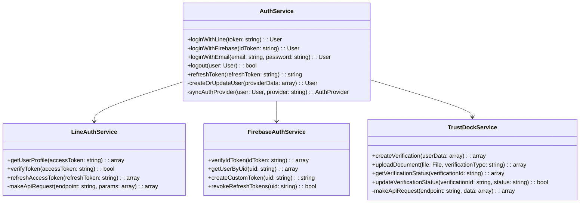
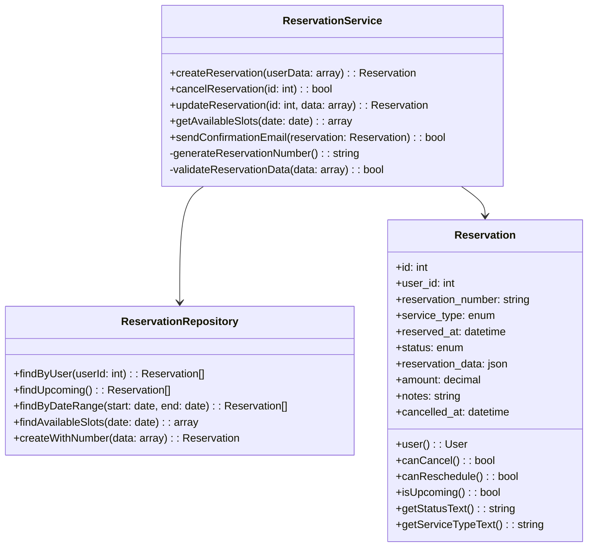
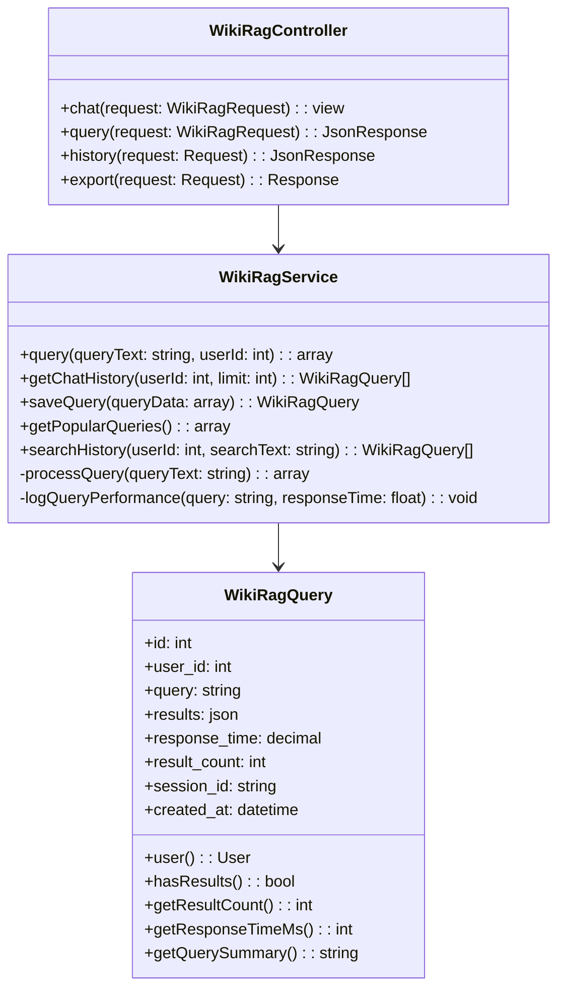
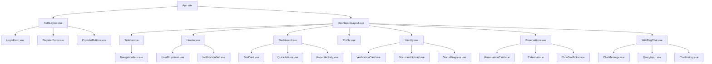

# 🏗️ MyPage統合認証システム クラス設計・フォルダー構成

## 📂 完全フォルダー構成

```
autocreate/mypage-auth-system/
├── 📁 src/                           # パッケージソースコード
│   ├── 📁 Console/
│   │   └── Commands/
│   │       ├── InstallCommand.php
│   │       └── PublishCommand.php
│   ├── 📁 Controllers/
│   │   ├── AuthController.php
│   │   ├── DashboardController.php
│   │   ├── IdentityController.php
│   │   ├── ReservationController.php
│   │   └── WikiRagController.php
│   ├── 📁 Models/
│   │   ├── User.php
│   │   ├── UserProfile.php
│   │   ├── AuthProvider.php
│   │   ├── IdentityVerification.php
│   │   ├── Reservation.php
│   │   ├── WikiRagQuery.php
│   │   └── ActivityLog.php
│   ├── 📁 Services/
│   │   ├── AuthService.php
│   │   ├── LineAuthService.php
│   │   ├── FirebaseAuthService.php
│   │   ├── TrustDockService.php
│   │   ├── ReservationService.php
│   │   └── WikiRagService.php
│   ├── 📁 Repositories/
│   │   ├── UserRepository.php
│   │   ├── AuthProviderRepository.php
│   │   ├── IdentityVerificationRepository.php
│   │   └── ReservationRepository.php
│   ├── 📁 Http/
│   │   ├── Requests/
│   │   │   ├── AuthRequest.php
│   │   │   ├── ProfileUpdateRequest.php
│   │   │   ├── ReservationRequest.php
│   │   │   └── WikiRagRequest.php
│   │   ├── Resources/
│   │   │   ├── UserResource.php
│   │   │   ├── AuthProviderResource.php
│   │   │   ├── ReservationResource.php
│   │   │   └── WikiRagQueryResource.php
│   │   └── Middleware/
│   │       ├── AuthMiddleware.php
│   │       └── IdentityVerificationMiddleware.php
│   ├── 📁 Events/
│   │   ├── UserRegistered.php
│   │   ├── IdentityVerified.php
│   │   └── ReservationCreated.php
│   ├── 📁 Listeners/
│   │   ├── SendWelcomeEmail.php
│   │   ├── UpdateIdentityStatus.php
│   │   └── SendReservationConfirmation.php
│   ├── 📁 Jobs/
│   │   ├── ProcessIdentityVerification.php
│   │   ├── SendNotificationEmail.php
│   │   └── SyncWikiRagData.php
│   ├── 📁 Notifications/
│   │   ├── WelcomeNotification.php
│   │   ├── IdentityVerificationNotification.php
│   │   └── ReservationConfirmationNotification.php
│   ├── 📁 Exceptions/
│   │   ├── AuthenticationException.php
│   │   ├── IdentityVerificationException.php
│   │   └── WikiRagException.php
│   ├── 📁 Traits/
│   │   ├── HasAuthProviders.php
│   │   ├── HasIdentityVerification.php
│   │   └── LogsActivity.php
│   └── ServiceProvider.php
│
├── 📁 resources/                      # フロントエンドリソース
│   ├── 📁 views/
│   │   ├── 📁 auth/
│   │   │   ├── login.blade.php
│   │   │   ├── register.blade.php
│   │   │   └── callback.blade.php
│   │   ├── 📁 dashboard/
│   │   │   ├── index.blade.php
│   │   │   ├── profile.blade.php
│   │   │   └── settings.blade.php
│   │   ├── 📁 identity/
│   │   │   ├── index.blade.php
│   │   │   ├── upload.blade.php
│   │   │   └── status.blade.php
│   │   ├── 📁 reservations/
│   │   │   ├── index.blade.php
│   │   │   ├── create.blade.php
│   │   │   └── show.blade.php
│   │   ├── 📁 wiki-rag/
│   │   │   ├── chat.blade.php
│   │   │   └── history.blade.php
│   │   ├── 📁 layouts/
│   │   │   ├── app.blade.php
│   │   │   ├── auth.blade.php
│   │   │   └── dashboard.blade.php
│   │   └── 📁 components/
│   │       ├── navigation.blade.php
│   │       ├── sidebar.blade.php
│   │       └── notification.blade.php
│   ├── 📁 js/
│   │   ├── 📁 components/
│   │   │   ├── AuthForm.vue
│   │   │   ├── Dashboard.vue
│   │   │   ├── IdentityUpload.vue
│   │   │   ├── ReservationCalendar.vue
│   │   │   └── WikiRagChat.vue
│   │   ├── 📁 composables/
│   │   │   ├── useAuth.js
│   │   │   ├── useIdentity.js
│   │   │   ├── useReservation.js
│   │   │   └── useWikiRag.js
│   │   ├── 📁 stores/
│   │   │   ├── authStore.js
│   │   │   ├── userStore.js
│   │   │   └── notificationStore.js
│   │   └── app.js
│   ├── 📁 css/
│   │   ├── app.css
│   │   ├── dashboard.css
│   │   └── components.css
│   └── 📁 sass/
│       ├── _variables.scss
│       ├── _mixins.scss
│       └── app.scss
│
├── 📁 database/                       # データベース関連
│   ├── 📁 migrations/
│   │   ├── 2024_01_01_000001_create_users_table.php
│   │   ├── 2024_01_01_000002_create_user_profiles_table.php
│   │   ├── 2024_01_01_000003_create_auth_providers_table.php
│   │   ├── 2024_01_01_000004_create_identity_verifications_table.php
│   │   ├── 2024_01_01_000005_create_reservations_table.php
│   │   ├── 2024_01_01_000006_create_wiki_rag_queries_table.php
│   │   └── 2024_01_01_000007_create_activity_logs_table.php
│   ├── 📁 factories/
│   │   ├── UserFactory.php
│   │   ├── AuthProviderFactory.php
│   │   ├── IdentityVerificationFactory.php
│   │   └── ReservationFactory.php
│   └── 📁 seeders/
│       ├── UserSeeder.php
│       ├── AuthProviderSeeder.php
│       └── DatabaseSeeder.php
│
├── 📁 tests/                          # テストファイル
│   ├── 📁 Unit/
│   │   ├── 📁 Models/
│   │   ├── 📁 Services/
│   │   └── 📁 Repositories/
│   ├── 📁 Feature/
│   │   ├── 📁 Auth/
│   │   ├── 📁 Dashboard/
│   │   └── 📁 Reservations/
│   ├── 📁 Integration/
│   ├── 📁 E2E/
│   ├── 📁 Mocks/
│   └── 📁 Fixtures/
│
├── 📁 config/                         # 設定ファイル
│   ├── mypage-auth.php
│   ├── services.php
│   └── identity-verification.php
│
├── 📁 routes/                         # ルーティング
│   ├── web.php
│   ├── api.php
│   └── auth.php
│
├── 📁 docs/                           # ドキュメント
│   ├── 📁 installation/
│   ├── 📁 configuration/
│   ├── 📁 usage/
│   ├── 📁 api/
│   └── 📁 examples/
│
├── 📁 .github/                        # GitHub Actions
│   ├── 📁 workflows/
│   │   ├── ci.yml
│   │   ├── release.yml
│   │   └── package-publish.yml
│   ├── 📁 ISSUE_TEMPLATE/
│   └── PULL_REQUEST_TEMPLATE.md
│
├── 📁 docker/                         # Docker設定
│   ├── Dockerfile
│   ├── docker-compose.yml
│   └── nginx.conf
│
├── package.json
├── composer.json
├── phpunit.xml
├── phpstan.neon
├── .php-cs-fixer.php
├── .pre-commit-config.yaml
├── README.md
├── CHANGELOG.md
├── LICENSE
└── .env.example
```

## 🏗️ メインクラス設計

### 1. 認証サービス設計


### 2. ユーザー関連モデル設計
```mermaid
classDiagram
    class User {
        +id: int
        +uuid: string
        +email: string
        +name: string
        +phone: string
        +email_verified_at: datetime
        +created_at: datetime
        +updated_at: datetime
        +deleted_at: datetime
        
        +profile(): UserProfile
        +authProviders(): AuthProvider[]
        +identityVerifications(): IdentityVerification[]
        +reservations(): Reservation[]
        +wikiRagQueries(): WikiRagQuery[]
        +activityLogs(): ActivityLog[]
        
        +hasVerifiedEmail(): bool
        +getIdentityLevel(): int
        +canMakeReservation(): bool
        +getMainAuthProvider(): AuthProvider
    }
    
    class UserProfile {
        +id: int
        +user_id: int
        +first_name: string
        +last_name: string
        +first_name_kana: string
        +last_name_kana: string
        +birth_date: date
        +gender: enum
        +postal_code: string
        +address: string
        +avatar_url: string
        +preferences: json
        
        +user(): User
        +getFullName(): string
        +getFullNameKana(): string
        +getAge(): int
        +isProfileComplete(): bool
    }
    
    class AuthProvider {
        +id: int
        +user_id: int
        +provider_type: enum
        +provider_id: string
        +provider_email: string
        +provider_data: json
        +access_token: string
        +refresh_token: string
        +token_expires_at: datetime
        +is_primary: bool
        
        +user(): User
        +isTokenValid(): bool
        +refreshToken(): bool
        +getProviderName(): string
    }
    
    class IdentityVerification {
        +id: int
        +user_id: int
        +verification_type: enum
        +status: enum
        +trustdock_user_id: string
        +verification_id: string
        +verification_data: json
        +documents: json
        +verified_at: datetime
        +expires_at: datetime
        +notes: string
        
        +user(): User
        +isApproved(): bool
        +isExpired(): bool
        +canUpgrade(): bool
        +getStatusText(): string
    }
    
    User ||--|| UserProfile
    User ||--o{ AuthProvider
    User ||--o{ IdentityVerification
```

### 3. 予約システム設計


### 4. WIKI RAG統合設計


## 🎨 UI/UXコンポーネント設計

### Vue.js コンポーネント階層


### Blade テンプレート構成
```
resources/views/
├── layouts/
│   ├── app.blade.php              # メインレイアウト
│   ├── auth.blade.php             # 認証ページレイアウト
│   └── dashboard.blade.php        # ダッシュボードレイアウト
├── components/
│   ├── navigation.blade.php       # ナビゲーション
│   ├── sidebar.blade.php          # サイドバー
│   ├── breadcrumb.blade.php       # パンくずリスト
│   └── notification.blade.php     # 通知コンポーネント
├── auth/
│   ├── login.blade.php           # ログイン画面
│   ├── register.blade.php        # 登録画面
│   └── callback.blade.php        # 認証コールバック
├── dashboard/
│   ├── index.blade.php           # ダッシュボード
│   ├── profile.blade.php         # プロフィール
│   └── settings.blade.php        # 設定
├── identity/
│   ├── index.blade.php           # 本人確認トップ
│   ├── upload.blade.php          # 書類アップロード
│   └── status.blade.php          # 認証状況
├── reservations/
│   ├── index.blade.php           # 予約一覧
│   ├── create.blade.php          # 新規予約
│   └── show.blade.php            # 予約詳細
└── wiki-rag/
    ├── chat.blade.php            # チャット画面
    └── history.blade.php         # 履歴画面
```

## 🎯 ブランチ戦略・Issue管理

### Git Flow ブランチ戦略
```mermaid
gitgraph
    commit id: "Initial"
    branch develop
    checkout develop
    commit id: "Database Setup"
    
    branch feature/auth-system
    checkout feature/auth-system
    commit id: "LINE Auth"
    commit id: "Firebase Auth"
    commit id: "TrustDock Integration"
    
    checkout develop
    merge feature/auth-system
    
    branch feature/ui-components
    checkout feature/ui-components
    commit id: "Vue Components"
    commit id: "Blade Templates"
    commit id: "CSS Styling"
    
    checkout develop
    merge feature/ui-components
    
    branch feature/wiki-rag
    checkout feature/wiki-rag
    commit id: "RAG Service"
    commit id: "Chat UI"
    
    checkout develop
    merge feature/wiki-rag
    
    checkout main
    merge develop
    commit id: "v1.0.0 Release"
```

### Issue テンプレート
```markdown
## 🎯 作業内容
- [ ] クラス設計実装
- [ ] テストコード作成
- [ ] ドキュメント更新

## 📋 チェックリスト
- [ ] コードレビュー完了
- [ ] テストカバレッジ85%以上
- [ ] CI/CD パス
- [ ] ドキュメント更新

## 🔗 関連リンク
- 設計書: /docs/design/
- テスト: /tests/
- UI/UX: /resources/views/
```

---

これで完全なクラス設計・フォルダー構成・UI/UX表示が完成！
Issue・チケット・ブランチで引継ぎ可能な状態だね！🚀
