# 🚀 MyPage統合認証システム CI/CD設計

## 🎯 CI/CD戦略概要

### 自動化フロー全体図

```mermaid
graph TB
    A[開発者コミット] --> B[Pre-commit Hooks]
    B --> C[Push to GitHub]
    C --> D[GitHub Actions]
    
    D --> E{ブランチ確認}
    E -->|feature/*| F[開発環境テスト]
    E -->|develop| G[統合テスト]
    E -->|main| H[本番リリース]
    
    F --> I[PHPStan静的解析]
    F --> J[PHPUnit テスト]
    F --> K[PHP CS Fixer]
    
    G --> L[全テストスイート]
    G --> M[セキュリティスキャン]
    G --> N[パフォーマンステスト]
    
    H --> O[本番テスト]
    H --> P[パッケージビルド]
    H --> Q[GitHub Release]
    H --> R[Packagist登録]
    H --> S[Docker Hub Push]
```


### リポジトリ戦略

```mermaid
graph TB
    A[autocreate-mypage-auth] --> B[メインリポジトリ]
    A --> C[サンプルプロジェクト]
    A --> D[Packagist Package]
    A --> E[Docker Image]
    
    B --> F[Laravel Package]
    B --> G[完全ドキュメント]
    B --> H[GitHub Actions]
    
    C --> I[デモサイト]
    C --> J[インストールガイド]
    C --> K[使用例]
    
    D --> L[Composer install]
    D --> M[バージョン管理]
    
    E --> N[即座にデプロイ可能]
    E --> O[本番環境対応]
```


## 📂 CI/CDファイル構成

### GitHub Actions ワークフロー
```
.github/
├── workflows/
│   ├── ci.yml                  # メインCI
│   ├── security.yml            # セキュリティスキャン
│   ├── deploy-staging.yml      # ステージング自動デプロイ
│   ├── release.yml             # 本番リリース
│   └── package-publish.yml     # Packagist・Docker公開
├── ISSUE_TEMPLATE/
│   ├── bug_report.md
│   ├── feature_request.md
│   └── question.md
└── PULL_REQUEST_TEMPLATE.md
```

### Pre-commit設定
```
.pre-commit-config.yaml
composer.json (scripts)
phpstan.neon
.php-cs-fixer.php
```

## 🔧 GitHub Actions ワークフロー実装

### 1. メインCI (ci.yml)
```yaml
name: CI

on:
  push:
    branches: [ main, develop ]
  pull_request:
    branches: [ main, develop ]

jobs:
  test:
    runs-on: ubuntu-latest
    
    strategy:
      matrix:
        php-version: [8.1, 8.2, 8.3]
        laravel-version: [10.x, 11.x]
    
    services:
      mysql:
        image: mysql:8.0
        env:
          MYSQL_ROOT_PASSWORD: password
          MYSQL_DATABASE: mypage_auth_test
        ports:
          - 3306:3306
        options: --health-cmd="mysqladmin ping" --health-interval=10s --health-timeout=5s --health-retries=3
      
      redis:
        image: redis:alpine
        ports:
          - 6379:6379
        options: --health-cmd="redis-cli ping" --health-interval=10s --health-timeout=5s --health-retries=3

    steps:
    - name: Checkout code
      uses: actions/checkout@v4

    - name: Setup PHP
      uses: shivammathur/setup-php@v2
      with:
        php-version: ${{ matrix.php-version }}
        extensions: dom, curl, libxml, mbstring, zip, pcntl, pdo, sqlite, pdo_sqlite, bcmath, soap, intl, gd, exif, iconv
        coverage: xdebug

    - name: Cache Composer dependencies
      uses: actions/cache@v3
      with:
        path: ~/.composer/cache/files
        key: composer-${{ matrix.php-version }}-${{ hashFiles('composer.lock') }}

    - name: Install Composer dependencies
      run: composer install --prefer-dist --no-interaction --no-progress

    - name: Create Laravel app key
      run: php artisan key:generate --env=testing

    - name: Run database migrations
      run: php artisan migrate --env=testing --force

    - name: Run PHPStan static analysis
      run: vendor/bin/phpstan analyse --memory-limit=2G

    - name: Run PHP CS Fixer
      run: vendor/bin/php-cs-fixer fix --dry-run --diff --verbose

    - name: Run PHPUnit tests
      run: vendor/bin/phpunit --coverage-clover=coverage.xml

    - name: Upload coverage to Codecov
      uses: codecov/codecov-action@v3
      with:
        file: ./coverage.xml
        fail_ci_if_error: true

  security:
    runs-on: ubuntu-latest
    steps:
    - name: Checkout code
      uses: actions/checkout@v4

    - name: Run security audit
      run: composer audit --no-dev

    - name: Run Psalm security analysis
      run: vendor/bin/psalm --taint-analysis

  frontend:
    runs-on: ubuntu-latest
    steps:
    - name: Checkout code
      uses: actions/checkout@v4

    - name: Setup Node.js
      uses: actions/setup-node@v4
      with:
        node-version: '18'
        cache: 'npm'

    - name: Install dependencies
      run: npm ci

    - name: Run ESLint
      run: npm run lint

    - name: Run build
      run: npm run build

    - name: Run E2E tests
      run: npm run test:e2e
```

### 2. リリース自動化 (release.yml)
```yaml
name: Release

on:
  push:
    tags:
      - 'v*'

jobs:
  release:
    runs-on: ubuntu-latest
    steps:
    - name: Checkout code
      uses: actions/checkout@v4
      with:
        fetch-depth: 0

    - name: Setup PHP
      uses: shivammathur/setup-php@v2
      with:
        php-version: 8.2

    - name: Install dependencies
      run: composer install --no-dev --optimize-autoloader

    - name: Build documentation
      run: |
        php artisan docs:build
        npm run docs:build

    - name: Create release archive
      run: |
        zip -r mypage-auth-system-${GITHUB_REF#refs/tags/}.zip . \
          -x "*.git*" "node_modules/*" "tests/*" ".env*"

    - name: Generate changelog
      id: changelog
      run: |
        echo "## Changes" > CHANGELOG.md
        git log --pretty=format:"- %s" $(git describe --tags --abbrev=0 HEAD^)..HEAD >> CHANGELOG.md

    - name: Create GitHub Release
      uses: actions/create-release@v1
      env:
        GITHUB_TOKEN: ${{ secrets.GITHUB_TOKEN }}
      with:
        tag_name: ${{ github.ref }}
        release_name: Release ${{ github.ref }}
        body_path: CHANGELOG.md
        draft: false
        prerelease: false

    - name: Upload release asset
      uses: actions/upload-release-asset@v1
      env:
        GITHUB_TOKEN: ${{ secrets.GITHUB_TOKEN }}
      with:
        upload_url: ${{ steps.create_release.outputs.upload_url }}
        asset_path: ./mypage-auth-system-${{ github.ref }}.zip
        asset_name: mypage-auth-system-${{ github.ref }}.zip
        asset_content_type: application/zip

  packagist:
    needs: release
    runs-on: ubuntu-latest
    steps:
    - name: Notify Packagist
      run: |
        curl -XPOST -H'content-type:application/json' \
        'https://packagist.org/api/update-package?username=${{ secrets.PACKAGIST_USERNAME }}&apiToken=${{ secrets.PACKAGIST_TOKEN }}' \
        -d'{"repository":{"url":"https://github.com/${{ github.repository }}"}}'

  docker:
    needs: release
    runs-on: ubuntu-latest
    steps:
    - name: Checkout code
      uses: actions/checkout@v4

    - name: Set up Docker Buildx
      uses: docker/setup-buildx-action@v3

    - name: Login to Docker Hub
      uses: docker/login-action@v3
      with:
        username: ${{ secrets.DOCKERHUB_USERNAME }}
        password: ${{ secrets.DOCKERHUB_TOKEN }}

    - name: Extract version
      id: extract_version
      run: echo "VERSION=${GITHUB_REF#refs/tags/}" >> $GITHUB_OUTPUT

    - name: Build and push Docker image
      uses: docker/build-push-action@v5
      with:
        context: .
        push: true
        tags: |
          autocreate/mypage-auth:latest
          autocreate/mypage-auth:${{ steps.extract_version.outputs.VERSION }}
        platforms: linux/amd64,linux/arm64
```

### 3. パッケージ公開 (package-publish.yml)
```yaml
name: Package Publish

on:
  release:
    types: [published]

jobs:
  composer-package:
    runs-on: ubuntu-latest
    steps:
    - name: Checkout code
      uses: actions/checkout@v4

    - name: Validate composer.json
      run: composer validate --strict

    - name: Update Packagist
      run: |
        curl -XPOST -H'content-type:application/json' \
        'https://packagist.org/api/update-package?username=${{ secrets.PACKAGIST_USERNAME }}&apiToken=${{ secrets.PACKAGIST_TOKEN }}' \
        -d'{"repository":{"url":"https://github.com/${{ github.repository }}"}}'

  npm-package:
    runs-on: ubuntu-latest
    steps:
    - name: Checkout code
      uses: actions/checkout@v4

    - name: Setup Node.js
      uses: actions/setup-node@v4
      with:
        node-version: '18'
        registry-url: 'https://registry.npmjs.org'

    - name: Install dependencies
      run: npm ci

    - name: Build package
      run: npm run build

    - name: Publish to npm
      run: npm publish
      env:
        NODE_AUTH_TOKEN: ${{ secrets.NPM_TOKEN }}
```

## 🔧 Pre-commit設定

### .pre-commit-config.yaml
```yaml
repos:
  - repo: https://github.com/pre-commit/pre-commit-hooks
    rev: v4.4.0
    hooks:
      - id: trailing-whitespace
      - id: end-of-file-fixer
      - id: check-yaml
      - id: check-json
      - id: check-merge-conflict

  - repo: local
    hooks:
      - id: php-cs-fixer
        name: PHP CS Fixer
        entry: vendor/bin/php-cs-fixer fix
        language: system
        files: \.php$
        
      - id: phpstan
        name: PHPStan
        entry: vendor/bin/phpstan analyse --memory-limit=2G
        language: system
        files: \.php$
        
      - id: phpunit
        name: PHPUnit
        entry: vendor/bin/phpunit --testsuite=Unit
        language: system
        files: \.php$
        pass_filenames: false

  - repo: https://github.com/pre-commit/mirrors-eslint
    rev: v8.57.0
    hooks:
      - id: eslint
        files: \.(js|ts|vue)$
        additional_dependencies:
          - eslint@8.57.0
          - '@typescript-eslint/parser@6.21.0'
```

### composer.json (scripts追加)
```json
{
  "scripts": {
    "pre-commit": [
      "@php-cs-fixer",
      "@phpstan",
      "@test-unit"
    ],
    "php-cs-fixer": "php-cs-fixer fix --dry-run --diff",
    "php-cs-fixer-fix": "php-cs-fixer fix",
    "phpstan": "phpstan analyse --memory-limit=2G",
    "test": "phpunit",
    "test-unit": "phpunit --testsuite=Unit",
    "test-feature": "phpunit --testsuite=Feature",
    "test-coverage": "phpunit --coverage-html coverage/",
    "security-audit": "composer audit --no-dev",
    "docs-build": "php artisan docs:generate"
  }
}
```

## 🚀 サンプルリポジトリ構成

### リポジトリ名
```
autocreate/mypage-auth-system
```

### README.md (Packagistでの表示)
```markdown
# 🔐 MyPage統合認証システム

LINE・Firebase・TrustDock統合認証 + 予約管理 + WIKI RAG AI搭載

[](https://github.com/autocreate/mypage-auth-system/actions/workflows/ci.yml)
[](https://codecov.io/gh/autocreate/mypage-auth-system)
[](https://packagist.org/packages/autocreate/mypage-auth-system)
[](https://packagist.org/packages/autocreate/mypage-auth-system)

## 🚀 クイックスタート

```bash
composer require autocreate/mypage-auth-system
php artisan vendor:publish --provider="AutoCreate\MyPageAuth\ServiceProvider"
php artisan migrate
```

## ✨ 特徴

- 🔐 **統合認証**: LINE・Firebase・TrustDock
- 📱 **レスポンシブUI**: 美しいダッシュボード
- 🤖 **AI統合**: WIKI RAG検索機能
- 📅 **予約管理**: 完全な予約システム
- 🧪 **テスト完備**: 95%+ カバレッジ
- 🚀 **本番対応**: Docker・CI/CD完備
```

### composer.json (パッケージ用)
```json
{
    "name": "autocreate/mypage-auth-system",
    "description": "LINE・Firebase・TrustDock統合認証システム with 予約管理 & WIKI RAG AI",
    "keywords": ["laravel", "authentication", "line", "firebase", "trustdock", "reservation", "ai", "rag"],
    "license": "MIT",
    "type": "library",
    "authors": [
        {
            "name": "AutoCreate Team",
            "email": "dev@autocreate.com"
        }
    ],
    "require": {
        "php": "^8.1",
        "laravel/framework": "^10.0|^11.0",
        "socialiteproviders/line": "^4.0",
        "kreait/firebase-php": "^7.0",
        "guzzlehttp/guzzle": "^7.0"
    },
    "require-dev": {
        "phpunit/phpunit": "^10.0",
        "phpstan/phpstan": "^1.0",
        "friendsofphp/php-cs-fixer": "^3.0",
        "mockery/mockery": "^1.0"
    },
    "autoload": {
        "psr-4": {
            "AutoCreate\\MyPageAuth\\": "src/"
        }
    },
    "autoload-dev": {
        "psr-4": {
            "AutoCreate\\MyPageAuth\\Tests\\": "tests/"
        }
    },
    "extra": {
        "laravel": {
            "providers": [
                "AutoCreate\\MyPageAuth\\ServiceProvider"
            ]
        }
    },
    "config": {
        "sort-packages": true
    },
    "minimum-stability": "dev",
    "prefer-stable": true
}
```

## 🎯 リリース戦略

### バージョニング
- **v1.0.0**: 基本機能完成版
- **v1.1.0**: パフォーマンス改善
- **v1.2.0**: 新機能追加
- **v2.0.0**: メジャーアップデート

### 公開先
1. **GitHub**: ソースコード・Issues・Wiki
2. **Packagist**: Composer パッケージ
3. **Docker Hub**: コンテナイメージ
4. **npm**: フロントエンドコンポーネント

---

これでCI/CD → サンプルリポジトリ → パッケージング自動化の設計完成！
GitHub Actionsで本番レベルの自動化ができるよ！🚀
