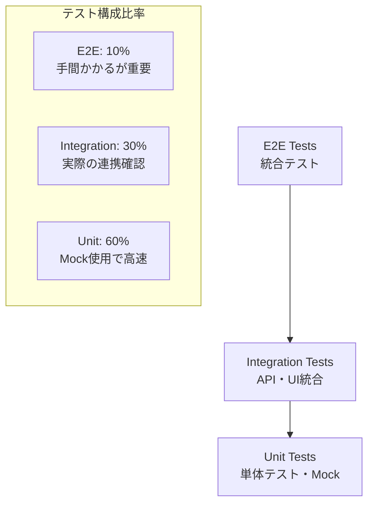
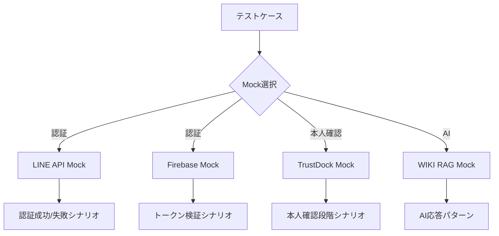

# 🧪 MyPage統合認証システム テストファースト設計

## 🎯 テスト戦略概要

### テストピラミッド


## 🔧 Mock設計戦略

### 外部サービスMock


## 📂 テストファイル構成

```
tests/
├── Unit/                                    # 単体テスト (Mock中心)
│   ├── Models/
│   │   ├── UserTest.php
│   │   ├── AuthProviderTest.php
│   │   └── IdentityVerificationTest.php
│   ├── Services/
│   │   ├── AuthServiceTest.php
│   │   ├── TrustDockServiceTest.php
│   │   └── WikiRagServiceTest.php
│   └── Controllers/
│       ├── AuthControllerTest.php
│       └── DashboardControllerTest.php
│
├── Feature/                                 # 機能テスト (一部Mock)
│   ├── Auth/
│   │   ├── LineLoginTest.php
│   │   ├── FirebaseAuthTest.php
│   │   └── LogoutTest.php
│   ├── Dashboard/
│   │   ├── DashboardAccessTest.php
│   │   └── ProfileUpdateTest.php
│   └── Reservation/
│       ├── ReservationCreateTest.php
│       └── ReservationCancelTest.php
│
├── Integration/                             # 統合テスト (実際のAPI)
│   ├── AuthFlowTest.php
│   ├── ReservationFlowTest.php
│   └── WikiRagIntegrationTest.php
│
├── E2E/                                     # E2Eテスト (Browser)
│   ├── CompleteUserJourneyTest.php
│   └── AuthenticationFlowTest.php
│
├── Mocks/                                   # Mock定義
│   ├── LineApiMock.php
│   ├── FirebaseMock.php
│   ├── TrustDockMock.php
│   └── WikiRagMock.php
│
└── Fixtures/                                # テストデータ
    ├── users.json
    ├── auth_responses.json
    └── wiki_rag_responses.json
```

## 🏗️ Mock実装設計

### 1. LINE API Mock
```php
<?php
// tests/Mocks/LineApiMock.php

class LineApiMock
{
    private array $scenarios = [
        'success' => [
            'access_token' => 'mock_line_token_123',
            'user_id' => 'U1234567890abcdef',
            'display_name' => '田中太郎',
            'picture_url' => 'https://mock.line.me/avatar.jpg',
            'email' => 'tanaka@example.com'
        ],
        'invalid_token' => [
            'error' => 'invalid_request',
            'error_description' => 'Invalid access token'
        ],
        'network_error' => [
            'error' => 'network_timeout',
            'error_description' => 'Network timeout occurred'
        ]
    ];

    public function getUserProfile(string $accessToken, string $scenario = 'success'): array
    {
        // シナリオに応じた応答を返す
        if (!isset($this->scenarios[$scenario])) {
            throw new InvalidArgumentException("Unknown scenario: {$scenario}");
        }

        // 遅延をシミュレート (オプション)
        if ($scenario === 'network_error') {
            usleep(5000000); // 5秒
        }

        return $this->scenarios[$scenario];
    }

    public function verifyToken(string $accessToken, string $scenario = 'success'): bool
    {
        return $scenario === 'success';
    }
}
```

### 2. Firebase Mock
```php
<?php
// tests/Mocks/FirebaseMock.php

class FirebaseMock
{
    private array $mockUsers = [
        'firebase_uid_123' => [
            'uid' => 'firebase_uid_123',
            'email' => 'user@example.com',
            'email_verified' => true,
            'display_name' => '山田花子',
            'photo_url' => 'https://mock.firebase.com/avatar.jpg',
            'provider_data' => [
                'google.com' => [
                    'uid' => 'google_123456',
                    'email' => 'user@gmail.com'
                ]
            ]
        ]
    ];

    public function verifyIdToken(string $idToken, string $scenario = 'success'): array
    {
        switch ($scenario) {
            case 'success':
                return $this->mockUsers['firebase_uid_123'];
            
            case 'expired_token':
                throw new FirebaseAuth\Token\IsExpired('Token expired');
            
            case 'invalid_token':
                throw new FirebaseAuth\Token\IsInvalid('Invalid token');
                
            default:
                throw new InvalidArgumentException("Unknown scenario: {$scenario}");
        }
    }
}
```

### 3. TrustDock Mock
```php
<?php
// tests/Mocks/TrustDockMock.php

class TrustDockMock
{
    private array $verificationScenarios = [
        'basic_pending' => [
            'status' => 'pending',
            'verification_type' => 'basic',
            'submitted_at' => '2024-06-15T10:00:00Z',
            'documents' => ['driver_license']
        ],
        'basic_approved' => [
            'status' => 'approved',
            'verification_type' => 'basic',
            'verified_at' => '2024-06-15T12:00:00Z',
            'expires_at' => '2025-06-15T12:00:00Z'
        ],
        'advanced_rejected' => [
            'status' => 'rejected',
            'verification_type' => 'advanced',
            'reason' => 'Document image quality insufficient',
            'rejected_at' => '2024-06-15T14:00:00Z'
        ]
    ];

    public function createVerification(array $data, string $scenario = 'basic_pending'): array
    {
        $response = $this->verificationScenarios[$scenario];
        $response['verification_id'] = 'trustdock_' . uniqid();
        
        return $response;
    }

    public function getVerificationStatus(string $verificationId, string $scenario = 'basic_approved'): array
    {
        return $this->verificationScenarios[$scenario];
    }
}
```

### 4. WIKI RAG Mock
```php
<?php
// tests/Mocks/WikiRagMock.php

class WikiRagMock
{
    private array $queryResponses = [
        'laravel_auth' => [
            'query' => 'Laravelの認証について',
            'results' => [
                [
                    'content' => 'Laravelの認証システムは...',
                    'score' => 0.85,
                    'source' => 'Laravel公式ドキュメント'
                ],
                [
                    'content' => 'ガード設定について...',
                    'score' => 0.72,
                    'source' => 'Laravel認証ガイド'
                ]
            ],
            'response_time' => 1.2,
            'result_count' => 2
        ],
        'empty_result' => [
            'query' => '存在しない情報',
            'results' => [],
            'response_time' => 0.8,
            'result_count' => 0
        ],
        'error_case' => [
            'error' => 'Service temporarily unavailable',
            'error_code' => 'SERVICE_UNAVAILABLE'
        ]
    ];

    public function query(string $query, string $scenario = 'laravel_auth'): array
    {
        if (!isset($this->queryResponses[$scenario])) {
            throw new InvalidArgumentException("Unknown scenario: {$scenario}");
        }

        $response = $this->queryResponses[$scenario];
        
        // エラーシナリオの場合は例外を投げる
        if (isset($response['error'])) {
            throw new WikiRagServiceException($response['error']);
        }

        return $response;
    }
}
```

## 🧪 テストケース例

### 1. 認証サービス単体テスト
```php
<?php
// tests/Unit/Services/AuthServiceTest.php

use Tests\TestCase;
use Tests\Mocks\LineApiMock;
use Tests\Mocks\FirebaseMock;
use App\Services\AuthService;

class AuthServiceTest extends TestCase
{
    private AuthService $authService;
    private LineApiMock $lineApiMock;
    private FirebaseMock $firebaseMock;

    protected function setUp(): void
    {
        parent::setUp();
        
        $this->lineApiMock = new LineApiMock();
        $this->firebaseMock = new FirebaseMock();
        
        // Mock を Service に注入
        $this->authService = new AuthService(
            $this->lineApiMock,
            $this->firebaseMock
        );
    }

    /** @test */
    public function line_login_success_creates_user()
    {
        // Arrange
        $accessToken = 'mock_line_token_123';
        
        // Act
        $result = $this->authService->loginWithLine($accessToken, 'success');
        
        // Assert
        $this->assertTrue($result['success']);
        $this->assertEquals('田中太郎', $result['user']['name']);
        $this->assertEquals('tanaka@example.com', $result['user']['email']);
        
        // データベース確認
        $this->assertDatabaseHas('users', [
            'email' => 'tanaka@example.com',
            'name' => '田中太郎'
        ]);
        
        $this->assertDatabaseHas('auth_providers', [
            'provider_type' => 'line',
            'provider_id' => 'U1234567890abcdef'
        ]);
    }

    /** @test */
    public function line_login_with_invalid_token_fails()
    {
        // Arrange
        $invalidToken = 'invalid_token';
        
        // Act & Assert
        $this->expectException(AuthenticationException::class);
        $this->authService->loginWithLine($invalidToken, 'invalid_token');
    }

    /** @test */
    public function firebase_login_success_creates_user()
    {
        // Arrange
        $idToken = 'mock_firebase_id_token';
        
        // Act
        $result = $this->authService->loginWithFirebase($idToken, 'success');
        
        // Assert
        $this->assertTrue($result['success']);
        $this->assertEquals('山田花子', $result['user']['name']);
    }
}
```

### 2. 本人確認機能テスト
```php
<?php
// tests/Unit/Services/TrustDockServiceTest.php

use Tests\TestCase;
use Tests\Mocks\TrustDockMock;
use App\Services\TrustDockService;

class TrustDockServiceTest extends TestCase
{
    private TrustDockService $trustDockService;
    private TrustDockMock $trustDockMock;

    protected function setUp(): void
    {
        parent::setUp();
        
        $this->trustDockMock = new TrustDockMock();
        $this->trustDockService = new TrustDockService($this->trustDockMock);
    }

    /** @test */
    public function basic_verification_can_be_submitted()
    {
        // Arrange
        $user = User::factory()->create();
        $verificationData = [
            'verification_type' => 'basic',
            'documents' => ['driver_license']
        ];
        
        // Act
        $result = $this->trustDockService->submitVerification(
            $user, 
            $verificationData, 
            'basic_pending'
        );
        
        // Assert
        $this->assertEquals('pending', $result['status']);
        $this->assertDatabaseHas('identity_verifications', [
            'user_id' => $user->id,
            'verification_type' => 'basic',
            'status' => 'pending'
        ]);
    }

    /** @test */
    public function verification_status_can_be_checked()
    {
        // Arrange
        $verification = IdentityVerification::factory()->create([
            'verification_id' => 'trustdock_123',
            'status' => 'processing'
        ]);
        
        // Act
        $status = $this->trustDockService->checkVerificationStatus(
            $verification->verification_id,
            'basic_approved'
        );
        
        // Assert
        $this->assertEquals('approved', $status['status']);
    }
}
```

### 3. 統合テスト例
```php
<?php
// tests/Feature/Auth/CompleteAuthFlowTest.php

use Tests\TestCase;
use Tests\Mocks\LineApiMock;

class CompleteAuthFlowTest extends TestCase
{
    /** @test */
    public function complete_line_login_flow_works()
    {
        // 実際のHTTPリクエストをテスト (一部Mock使用)
        
        // Step 1: ログイン画面表示
        $response = $this->get('/login');
        $response->assertStatus(200);
        $response->assertSee('LINE でログイン');
        
        // Step 2: LINE認証 (Mock使用)
        $this->withMock(LineApiMock::class, function ($mock) {
            $mock->shouldReceive('getUserProfile')
                 ->once()
                 ->andReturn([
                     'user_id' => 'U1234567890abcdef',
                     'display_name' => '田中太郎',
                     'email' => 'tanaka@example.com'
                 ]);
        });
        
        $response = $this->post('/auth/line/callback', [
            'access_token' => 'mock_token'
        ]);
        
        // Step 3: 認証後リダイレクト確認
        $response->assertRedirect('/dashboard');
        
        // Step 4: ダッシュボード表示確認
        $response = $this->get('/dashboard');
        $response->assertStatus(200);
        $response->assertSee('田中太郎');
    }
}
```

## 📊 テスト実行戦略

### 1. 開発時 (高速フィードバック)
```bash
# Mock中心の単体テスト (高速)
php artisan test --testsuite=Unit

# 特定クラスのテスト
php artisan test tests/Unit/Services/AuthServiceTest.php
```

### 2. CI/CD時 (品質保証)
```bash
# 全テスト実行
php artisan test

# カバレッジ付き
php artisan test --coverage --min=80
```

### 3. 本番デプロイ前 (最終確認)
```bash
# E2Eテスト (実際のブラウザ)
php artisan dusk

# パフォーマンステスト
php artisan test tests/Performance/
```

## 🎯 Mock使用のメリット

### ✅ 開発効率
- **高速実行**: 外部API待機なし
- **独立性**: ネットワーク状況に依存しない
- **再現性**: 同じ結果が必ず得られる

### ✅ テスト品質
- **エラーケース**: 通常発生しにくいエラーもテスト可能
- **境界値**: 極端なケースもシミュレート
- **段階テスト**: 各段階を個別にテスト

### ✅ 部分テスト
- **単一機能**: 1つの機能のみをテスト
- **依存排除**: 他の機能の影響を受けない
- **デバッグ容易**: 問題箇所を特定しやすい

---

これでテストファースト・Mock対応の設計完成！💪
部分的にテストできるから、開発もデバッグも効率的になるね！
