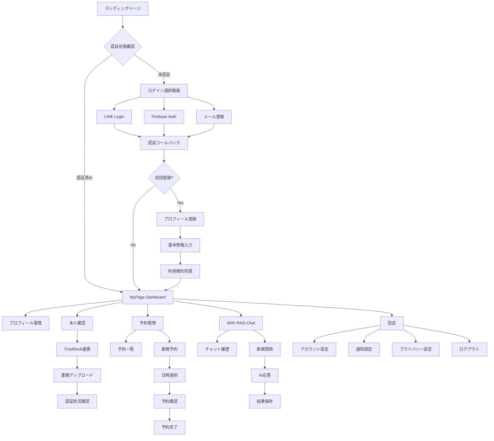

# 🎨 MyPage統合認証システム UI/UX設計

## 📱 画面遷移図



## 🖼️ 主要画面ワイヤーフレーム

### 1. ログイン選択画面
```
┌─────────────────────────────────────┐
│             MyPage Logo             │
├─────────────────────────────────────┤
│                                     │
│        ようこそ MyPage へ           │
│                                     │
│  ┌─────────────────────────────┐    │
│  │     📱 LINE でログイン      │    │
│  └─────────────────────────────┘    │
│                                     │
│  ┌─────────────────────────────┐    │
│  │     🔥 Firebase Auth       │    │
│  └─────────────────────────────┘    │
│                                     │
│  ┌─────────────────────────────┐    │
│  │     📧 メールで新規登録     │    │
│  └─────────────────────────────┘    │
│                                     │
│           利用規約 | プライバシー    │
└─────────────────────────────────────┘
```

### 2. MyPage Dashboard
```
┌─────────────────────────────────────┐
│ 🏠 MyPage    👤田中太郎  🔔 ⚙️ 🚪    │
├─────────────────────────────────────┤
│                                     │
│ ┌─────────────┐ ┌─────────────────┐ │
│ │ 📋 本人確認 │ │  📅 次回予約    │ │
│ │ ─────────── │ │  ─────────────  │ │
│ │ 基本: ✅    │ │  2024/6/20 14:00│ │
│ │ 詳細: 🟡    │ │  Web相談        │ │
│ │ 住所: ❌    │ │  [変更] [確認]  │ │
│ └─────────────┘ └─────────────────┘ │
│                                     │
│ ┌─────────────────────────────────┐ │
│ │        🤖 WIKI RAG Chat         │ │
│ │ ─────────────────────────────── │ │
│ │ 💬 最近の質問:                  │ │
│ │ "Laravelの認証機能について"     │ │
│ │                                 │ │
│ │ [新しい質問をする] [履歴を見る] │ │
│ └─────────────────────────────────┘ │
│                                     │
│ ┌─────────────┐ ┌─────────────────┐ │
│ │  📊 統計    │ │  📰 お知らせ    │ │
│ │ ─────────── │ │ ─────────────── │ │
│ │ 質問回数: 42│ │ システム       │ │
│ │ 予約回数: 8 │ │ メンテナンス...│ │
│ │ 認証Lv: 2   │ │ [すべて見る]   │ │
│ └─────────────┘ └─────────────────┘ │
└─────────────────────────────────────┘
```

### 3. 本人確認画面
```
┌─────────────────────────────────────┐
│ ← 戻る      本人確認      ❓ヘルプ    │
├─────────────────────────────────────┤
│                                     │
│ 📋 認証レベル進捗                   │
│ ━━━━━━━━━━━━━━━━━━━━━━━━━━━━━━     │
│                                     │
│ ✅ Level 1: 基本認証                │
│    メールアドレス確認済み           │
│    完了日: 2024/6/10               │
│                                     │
│ 🟡 Level 2: 身分証明書              │
│    運転免許証 or マイナンバーカード  │
│    ┌─────────────────────────────┐  │
│    │    📷 書類をアップロード    │  │
│    └─────────────────────────────┘  │
│                                     │
│ ⭕ Level 3: 住所確認                │
│    公共料金請求書等                 │
│    (Level 2完了後に利用可能)        │
│                                     │
│ ⭕ Level 4: 銀行口座確認            │
│    口座情報登録                     │
│    (Level 3完了後に利用可能)        │
│                                     │
│ ━━━━━━━━━━━━━━━━━━━━━━━━━━━━━━     │
│ 🔒 認証レベルが上がると、より多くの │
│    サービスをご利用いただけます     │
└─────────────────────────────────────┘
```

### 4. 予約管理画面
```
┌─────────────────────────────────────┐
│ ← 戻る      予約管理      + 新規予約 │
├─────────────────────────────────────┤
│                                     │
│ 📅 今後の予約                       │
│ ━━━━━━━━━━━━━━━━━━━━━━━━━━━━━━     │
│                                     │
│ ┌─────────────────────────────────┐ │
│ │ 📅 2024/6/20 (木) 14:00-15:00  │ │
│ │ 💼 Web相談                      │ │
│ │ 👤 担当: 田中サポート           │ │
│ │ 📝 備考: Laravel認証について   │ │
│ │                                 │ │
│ │ [変更] [キャンセル] [詳細]     │ │
│ └─────────────────────────────────┘ │
│                                     │
│ ┌─────────────────────────────────┐ │
│ │ 📅 2024/6/25 (火) 10:00-11:00  │ │
│ │ 🔧 システム保守                │ │
│ │ 👤 担当: 鈴木エンジニア         │ │
│ │ 📝 備考: 定期メンテナンス       │ │
│ │                                 │ │
│ │ [変更] [キャンセル] [詳細]     │ │
│ └─────────────────────────────────┘ │
│                                     │
│ 📋 過去の予約                       │
│ ━━━━━━━━━━━━━━━━━━━━━━━━━━━━━━     │
│ [すべて表示] [CSV出力]             │
└─────────────────────────────────────┘
```

### 5. WIKI RAG Chat画面
```
┌─────────────────────────────────────┐
│ ← 戻る      AI チャット     🔄 履歴  │
├─────────────────────────────────────┤
│                                     │
│ ┌─────────────────────────────────┐ │
│ │                                 │ │
│ │ 🤖: こんにちは！何でもお聞き   │ │
│ │     ください。WIKI情報から      │ │
│ │     最適な回答を見つけます。    │ │
│ │                                 │ │
│ │                        💬 AI    │ │
│ └─────────────────────────────────┘ │
│                                     │
│ ┌─────────────────────────────────┐ │
│ │ 👤: Laravelの認証機能について   │ │
│ │     教えてください              │ │
│ │                                 │ │
│ │ You 💬                          │ │
│ └─────────────────────────────────┘ │
│                                     │
│ ┌─────────────────────────────────┐ │
│ │ 🤖: Laravelの認証機能について   │ │
│ │     ご説明します...             │ │
│ │                                 │ │
│ │ 📚 参考情報:                   │ │
│ │ • Laravel公式ドキュメント       │ │
│ │ • 認証ガード設定               │ │
│ │ • Sanctum API認証              │ │
│ │                                 │ │
│ │ 👍 👎 📋 Copy                   │ │
│ └─────────────────────────────────┘ │
│                                     │
│ ┌─────────────────────────────────┐ │
│ │ 💬 メッセージを入力...           │
│ │                           🎤 📎│ │
│ └─────────────────────────────────┘ │
└─────────────────────────────────────┘
```

### 6. プロフィール管理画面
```
┌─────────────────────────────────────┐
│ ← 戻る      プロフィール    ✏️ 編集  │
├─────────────────────────────────────┤
│                                     │
│ ┌─────────────────────────────────┐ │
│ │        👤 田中 太郎             │ │
│ │     tanaka@example.com          │ │
│ │                                 │ │
│ │        📷 写真を変更            │ │
│ └─────────────────────────────────┘ │
│                                     │
│ 📋 基本情報                         │
│ ━━━━━━━━━━━━━━━━━━━━━━━━━━━━━━     │
│ 氏名: 田中 太郎                     │
│ フリガナ: タナカ タロウ             │
│ 生年月日: 1990/01/15               │
│ 性別: 男性                         │
│ 電話番号: 090-1234-5678             │
│                                     │
│ 📍 住所情報                         │
│ ━━━━━━━━━━━━━━━━━━━━━━━━━━━━━━     │
│ 郵便番号: 〒100-0001               │
│ 住所: 東京都千代田区千代田1-1-1     │
│                                     │
│ ⚙️ 設定                            │
│ ━━━━━━━━━━━━━━━━━━━━━━━━━━━━━━     │
│ 通知設定: メール ✅ SMS ❌          │
│ 言語設定: 日本語                   │
│ タイムゾーン: Asia/Tokyo            │
│                                     │
│ ┌─────────────────────────────────┐ │
│ │           💾 保存する            │ │
│ └─────────────────────────────────┘ │
└─────────────────────────────────────┘
```

## 📱 レスポンシブ対応

### モバイル画面例 (Dashboard)
```
┌─────────────────┐
│ 🏠 MyPage  👤🔔 │
├─────────────────┤
│                 │
│ ┌─────────────┐ │
│ │ 📋 本人確認 │ │
│ │ 基本: ✅    │ │
│ │ 詳細: 🟡    │ │
│ └─────────────┘ │
│                 │
│ ┌─────────────┐ │
│ │ 📅 次回予約 │ │
│ │ 6/20 14:00  │ │
│ │ Web相談     │ │
│ └─────────────┘ │
│                 │
│ ┌─────────────┐ │
│ │ 🤖 AI Chat  │ │
│ │ 最近の質問  │ │
│ │ Laravel認証 │ │
│ │ [質問する]  │ │
│ └─────────────┘ │
│                 │
│ ━━━━━━━━━━━━━━━ │
│ 🏠📅💬👤⚙️       │
└─────────────────┘
```

## 🎨 デザインシステム

### カラーパレット
```css
:root {
  /* Primary Colors */
  --primary-blue: #2563eb;
  --primary-light: #dbeafe;
  --primary-dark: #1d4ed8;
  
  /* Secondary Colors */
  --secondary-green: #16a34a;
  --secondary-orange: #ea580c;
  --secondary-purple: #9333ea;
  
  /* Status Colors */
  --success: #22c55e;
  --warning: #f59e0b;
  --error: #ef4444;
  --info: #3b82f6;
  
  /* Neutral Colors */
  --gray-50: #f9fafb;
  --gray-100: #f3f4f6;
  --gray-900: #111827;
  
  /* Authentication Provider Colors */
  --line-green: #00b900;
  --firebase-orange: #ff6f00;
  --trustdock-blue: #0066cc;
}
```

### タイポグラフィ
```css
/* 見出し */
h1 { font-size: 2rem; font-weight: 700; }
h2 { font-size: 1.5rem; font-weight: 600; }
h3 { font-size: 1.25rem; font-weight: 600; }

/* 本文 */
body { 
  font-family: 'Noto Sans JP', sans-serif;
  font-size: 1rem;
  line-height: 1.6;
}

/* コンポーネント */
.btn { padding: 0.75rem 1.5rem; border-radius: 0.5rem; }
.card { padding: 1.5rem; border-radius: 0.75rem; box-shadow: 0 1px 3px rgba(0,0,0,0.1); }
```

## 🔄 インタラクション設計

### 認証フロー
1. **ログイン選択** → スムーズなプロバイダー選択
2. **認証処理** → ローディング表示・進捗インジケーター
3. **初回登録** → ステップ形式のウィザード
4. **ダッシュボード** → アニメーション付きカード表示

### 状態管理
- **ローディング状態**: スケルトンUI
- **エラー状態**: 分かりやすいエラーメッセージ
- **成功状態**: 確認通知・フィードバック
- **空状態**: 適切なプレースホルダー

### アクセシビリティ
- **キーボードナビゲーション** 完全対応
- **スクリーンリーダー** 対応
- **カラーコントラスト** WCAG AA準拠
- **フォーカスインジケーター** 明確な表示

---

これで画面設計・UI/UX設計も完成！💪

次は実際のフロントエンドコンポーネント作成に進む？それとも認証システムの実装から？
