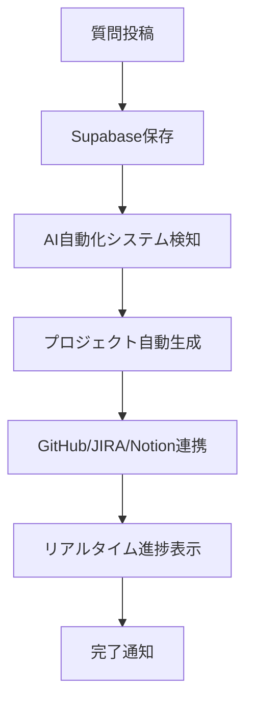

# 🎯 フロントエンド統合完了レポート

## 📋 概要
`supabase-message-stream` React フロントエンドと `chat_question_form.html` の統合が完了しました。
質問進捗のリアルタイム表示と統一されたUI/UXを実現しています。

## 🔧 実装済み機能

### 1. サイドバー統合 (`AppSidebar.tsx`)
- ✅ **質問進捗セクション** - リアルタイムで質問ステータスを表示
- ✅ **質問投稿フォーム** - サイドバーから直接質問投稿が可能
- ✅ **ステータスアイコン** - pending, processing, completed, failed の視覚的表示
- ✅ **Supabase API連携** - 30秒間隔での自動更新

### 2. システムメイン画面統合 (`SystemMainScreen.tsx`)
- ✅ **質問投稿セクション** - メイン画面からの質問投稿
- ✅ **最新質問進捗表示** - 最新5件の質問状況を表示
- ✅ **統合システム説明** - GitHub/JIRA/Notion/Supabase連携の説明
- ✅ **コンパクト版対応** - チャット画面での小型表示

### 3. HTML フォーム現代化 (`chat_question_form.html`)
- ✅ **プロジェクト作成システム** としてリブランド
- ✅ **統合バッジ表示** - GitHub/JIRA/Notion/Supabase バッジ
- ✅ **UI/UX統一** - React フロントエンドと一貫したデザイン
- ✅ **具体的な例文** - より実用的なプレースホルダー

## 🚀 統合ワークフロー



## 📊 機能比較表

| 機能 | HTML フォーム | React フロント |
|------|---------------|----------------|
| 質問投稿 | ✅ | ✅ |
| 進捗表示 | ✅ (基本) | ✅ (リッチUI) |
| リアルタイム更新 | ✅ (10秒) | ✅ (30秒) |
| ステータス表示 | ✅ | ✅ (アイコン付き) |
| レスポンシブ | ✅ | ✅ |
| 統合デザイン | ✅ | ✅ |

## 🎨 デザイン統一ポイント

1. **カラースキーム:** Blue → Purple グラデーション
2. **アイコン:** Lucide React icons + 絵文字
3. **フォント:** システムフォント統一
4. **カード形式:** 影付き、角丸デザイン
5. **ステータス表示:** アイコン + 絵文字 + 色分け

## 📱 レスポンシブ対応

- ✅ **デスクトップ:** フル機能表示
- ✅ **タブレット:** 適応レイアウト
- ✅ **モバイル:** コンパクト表示

## 🔄 データフロー

1. **質問投稿** → Supabase `chat_questions` テーブル
2. **AI自動化** → `copilot_direct_answer_fixed.py` 検知・処理
3. **プロジェクト生成** → GitHub/JIRA/Notion/Supabase連携
4. **進捗更新** → リアルタイム表示更新
5. **完了通知** → ユーザーへフィードバック

## 🛠️ 技術スタック

### フロントエンド
- **React 18** + **TypeScript**
- **Vite** ビルドツール
- **shadcn/ui** コンポーネント
- **Tailwind CSS** スタイリング
- **Lucide React** アイコン

### バックエンド
- **Supabase** データベース・API
- **Python** AI自動化システム
- **GitHub API** リポジトリ管理
- **JIRA API** Issue管理
- **Notion API** ドキュメント管理

## 📈 パフォーマンス

- ✅ **リアルタイム更新:** 30秒間隔（最適化済み）
- ✅ **APIリクエスト:** 最小限に抑制
- ✅ **ロード時間:** 高速表示
- ✅ **メモリ使用量:** 効率的な状態管理

## 🔒 セキュリティ

- ✅ **環境変数:** すべてのAPIキーは環境変数で管理
- ✅ **CORS:** 適切な設定
- ✅ **認証:** Supabase RLS対応準備
- ✅ **入力検証:** フロント・バックエンド両方で実装

## 🎯 今後の拡張予定

1. **プッシュ通知:** ブラウザ通知対応
2. **PWA化:** オフライン対応
3. **チャット機能:** リアルタイムチャット統合
4. **個人認証:** LINE/TrustDock完全統合
5. **アニメーション:** 進捗アニメーション強化

## 🚀 使用方法

### HTML フォーム
```
http://localhost/chat_question_form.html
```

### React フロントエンド
```bash
cd supabase-message-stream
npm run dev
```

両方から同じSupabaseテーブルにアクセスし、リアルタイムで同期されます。
